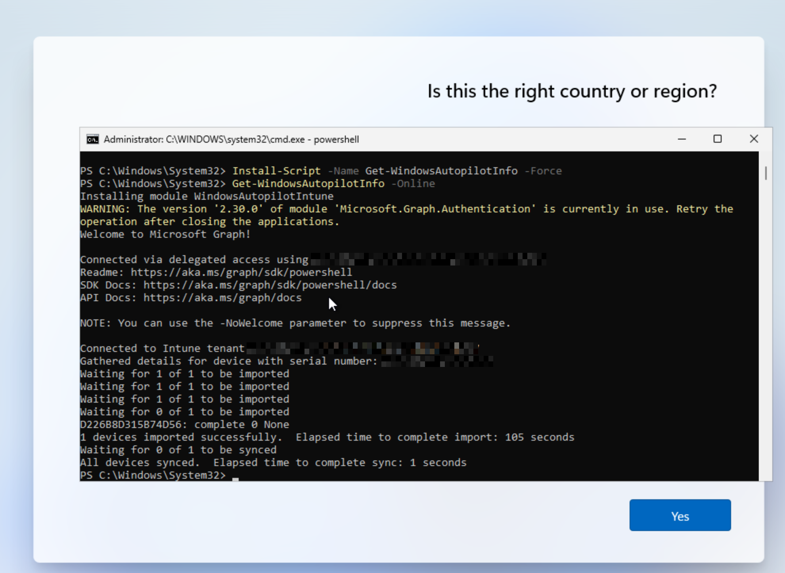

# Getting the Hardware Hash

In a real world scenario hardware hashes for each device would be provided to the organization by the device manufacturer, but since I can't do that I had to fake it a bit. 

I created a new Windows 11 VM and when it got to the select region screen I pressed Shift+F10 to open command prompt then ran the command `powershell` to get to open a new PowerShell session. 

The commands below do the following things:
- Installs Microsoft Graph
- Connects to Microsoft Graph using the TenantID provided
- Sets Execution Policy to Bypass
- Installs Windows Autopilot Info module
- Generates the device hardware hash and uploads it to the tenant

```
Set-ExecutionPolicy -Scope Process Bypass -Force
Install-Module Microsoft.Graph -Scope CurrentUser
Connect-MgGraph -Scopes "Group.ReadWrite.All" -TenantID "<Your Tenant ID>"
Install-Script -Name Get-WindowsAutopilotInfo -Force
Get-WindowsAutopilotInfo -Online
```



To confirm this was successful you can go to Intune > Devices > Enrollment > Windows Autopilot > Devices 


Here I can see my VM running on VMware "hardware". With this in place I'm ready to move on. 

# Creating Autopilot Device Group

I created a Dynamic Security group called All-Registered-Autopilot that will grab all devices registered to Autopilot. This will be the group I assign the Deployment Profile and Enrollment Status Page to.

Intune > Groups > New Group

- **Name**: All-Registered-Autopilot
- **Description**: All Devices registered to Autopilot
- **Membership Type**: Dynamic Device

Edit Dynamic Query > Configuration Rules 

```
(device.devicePhysicalIds -any (_ -startsWith "[ZTDId]"))
```

# Creating The Deployment Profile

My goal is to get a Windows 11 device to the point it could be purchased from the manufacturer, sent to a new employee, then the employee can use their corporate login credentials to sign in and set up the laptop. The configuration should take care of all setup and installs and leave as little as possible to the user.

I went to Intune > Devices > Enrollment > Windows > Deployment Profiles > Create Profile

I gave the following settings to create the profile:
- **Name**: Employee New Device
- **Description**: Windows 11 Employee Config
- **Deployment Mode**: User-Driven
- **Joint to Microsoft Entra ID as**: Microsoft Entra Joined
- **Apply a device name template**: Yes - `%SERIAL%-W`
- **Add Groups**: All-Registered-Autopilot

Summary of the Out-of-box experience (OOBE) settings 


# Creating an Enrollment Status Page (ESP)

Next I needed to create an Enrollment Status Page to prevent the user from affecting the device setup and also provide them visibility into the setup status.

To access the ESP settings I went to Intune > Devices > Enrollment > Windows > Enrollment Status Page > Create

I gave it a name to match the Configuration Profile and set **Show app and profile configuration progress** to Yes and left all other settings as default on this page. I also assigned it to apply to the All-Windows-11 group.

Summary of ESP Settings below:


The following settings are important here to make sure apps we install during setup finish before the computer is released to the user:

- **Block device use until all apps and profiles are installed**: Yes
- **Block device use until required apps are installed if they are assigned to the user/device**: All
# Testing Out-of-box experience (OOBE)

With the command prompt still open on the Windows VM, I ran the command below to shutdown the device and set it back to OOBE mode.

```
%SystemRoot%\System32\Sysprep\Sysprep.exe /oobe /shutdown
```

Once it turned back on I noticed the setup was different. It was now asking for a Microsoft Work/School account immediately. I chose one of the accounts from my organization at random and used their email address and password to login.

I noticed there were a few things I did not like about the OOBE setup. It asked the user to change their password as soon as they logged in. This may have been due to this being the first time they have ever logged in, or it could be set by Autopilot. I will need to look into this.

I also noticed it pushed the user into setting up a Windows Hello pin and then used that for login. I would instead prefer the user to have to use a domain user and password for login.

Lastly, I noticed it asked if the user wanted Microsoft 365 Copilot added to taskbar. I do not want my users to have this, or the question asking about it so I want to look into how to remove it. 
