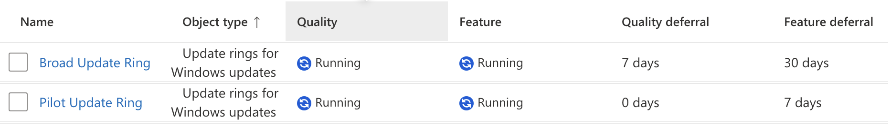
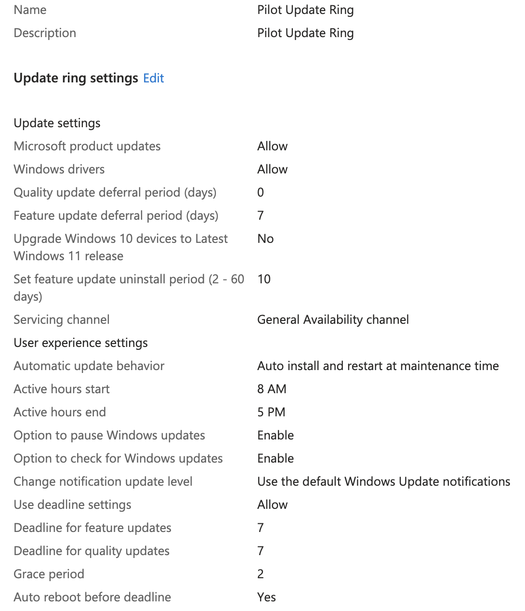
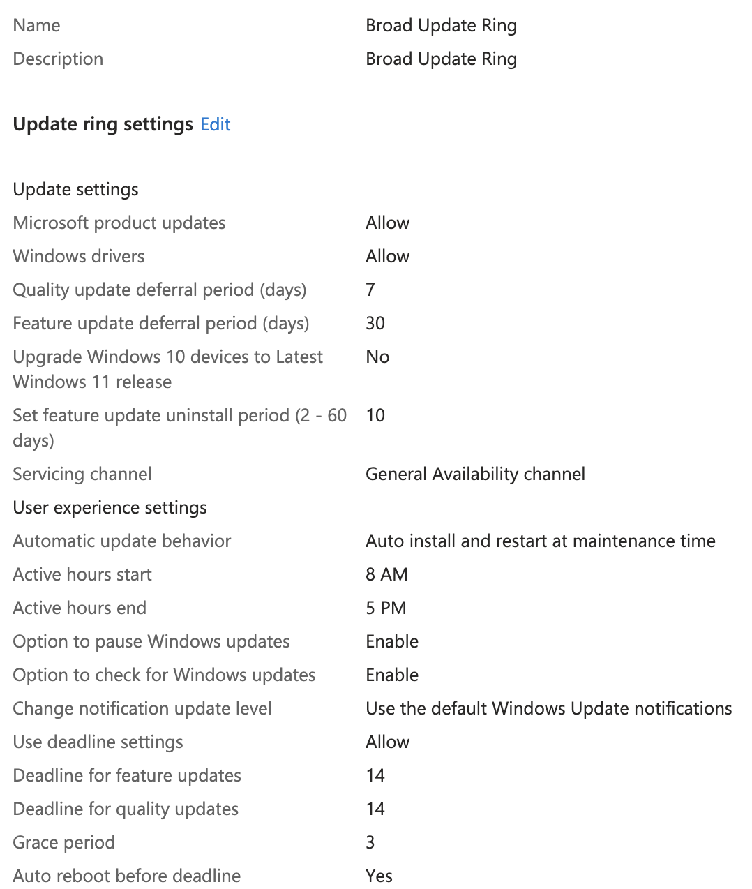

# What is an Update Ring?

An Update Ring is a policy setting within Intune that controls how and when the connected devices are able to run Windows updates. You can set different options like number of deferral days, update deadlines, reboot behavior, etc. You can develop different Update Rings and apply each to a different device group in what ever configuration makes the most sense for your environment. Its also important to know that Update Ring only affects Windows OS and Microsoft First Party updates which means custom LOB/Win32 apps will need to be kept up-to-date separately.

# Wait, I need another one?

For most organizations it makes sense to make at least two Update Rings, one to pilot more risky changes and updates, and a broader ring that controls updates on all devices. The broad ring is a slower, less update ring that you can trust in production across all devices. You will want to fill the pilot ring with more tech-savvy users and those who are less impactful on production if they shutdown unexpectedly. There is a wide range of issues that can be caused by a bad update, from bad drivers, broken network connections, other bugs etc. Having a pilot group protects the rest of the organization from experiencing these disruptions. I decided for my environment I would make all members of the IT team the pilot group and everyone else is in the broad group. 

# The Update of The Rings

To create the update rings you need to go to `Intune > Devices > Windows > Windows Updates > Update Rings > Create Profile` 

## Pilot Ring

The following settings will create an update ring that allows pilot users to defer feature updates for 7 days but does not let them defer quality updates. It also creates a 7 day deadline with a 2 day grace period. The ring is set to only affect IT users.

- **Name**: Pilot Update Ring
- **Description**: Pilot Update Ring
- **Quality update deferral period (days)**: 0
- **Feature update deferral period (days)**: 7
- **Automatic update behavior**: Auto install & restart at maintenance time
- **Use deadline settings**: Allow
- **Deadline for feature updates**: 7
- **Deadline for quality updates**: 7
- **Grace period**: 2
- **Included Groups**: IT

## Broad Ring

The following settings will create an update ring for the remaining users in the tenant. They are allowed to defer feature updates for 30 days and quality updates for 7 days. This setup also gives them a 14 day deadline with a 3 day grace period. This will apply to all users that are not in the IT department.

- **Name**: Broad Update Ring
- **Description**: Broad Update Ring
- **Quality update deferral period (days)**: 7
- **Feature update deferral period (days)**: 30
- **Automatic update behavior**: Auto install & restart at maintenance time
- **Use deadline settings**: Allow
- **Deadline for feature updates**: 14
- **Deadline for quality updates**: 14
- **Grace period**: 3
- **Included Groups**: All-Employees 
- **Excluded Groups**: IT

When all is said and done you should have something that looks like this.

This one is a little tougher to test since we would have to wait for Microsoft to issue a new update for Windows so we could see how it hit user devices differently. For now however, let's just trust that it's working properly.

