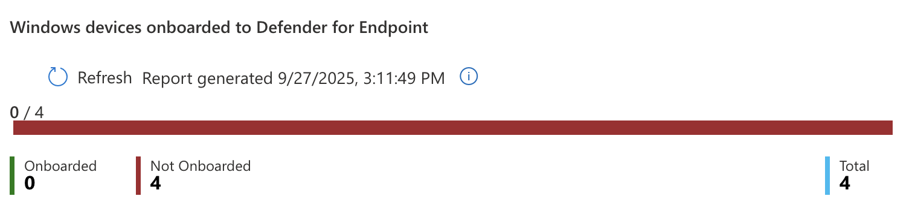
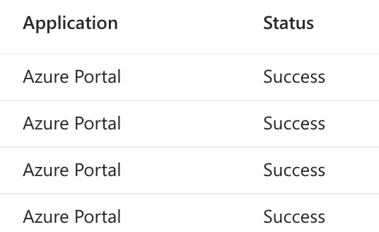
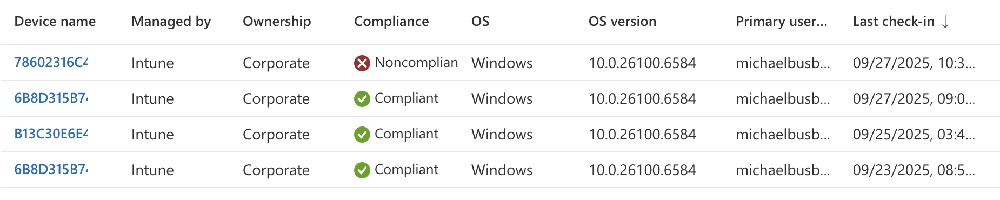

# Previous: [[5. Creating Update Rings]]

# Introduction to Security

One benefit of managing devices with Intune is that it gives you control of security features across the devices it manages and allows IT admins the ability to fine-tune their environments to meet their security and compliance needs. There are several methods available such as security baselines, defender for endpoint, compliance policies, conditional access, etc. that can be used to our benefit.

Every organization will have different concerns when it comes to data governance, risk, compliance, regulation, and other requirements make demands on how things can be structured. Since there is no one-size-fits-all solution to security, this section is meant as more of a walkthrough of options available within Intune rather than a comprehensive list of air-tight security measures. As always with security, consider your own threat model and how it applies to the resources available. 

# Security Baselines

Conveniently, Microsoft created a way for administrators to change granular security settings that can be saved as templates called Security Baselines. 

To access Security Baselines just go to `Intune > Endpoint security > Security Baselines > Security Baseline for Windows 10 and later > Create policy`. Most of the recommended defaults Microsoft gives us are pretty good so generally it is good enough to keep what is already in there but this would be the place to go for granular changes. 

- **Name**: Windows 11 Baseline
- **Description**: Windows 11 Baseline
- **Configuration Settings**: Keep Defaults
- **Assignments**: All-Employees and All-Windows-11


Once you save this baseline the security settings chosen in Configuration Settings will be enforced on all users and Windows 11 devices. If we wanted to tweak these settings later on we could come back and change the settings or possibly create a new baseline and assign it to a different group of users or devices. 

We could also consider, for testing purposes, limiting the rollout of this Security Baseline to our IT pilot users similar to howe we did with the Update Rings. This way we could ensure the baseline works correctly for non-critical users before pushing it out to all users.

# Defender for Endpoint

Microsoft Defender for Endpoint can be used as an Endpoint Detection and Response solution within your environment. You can create policies with Intune that onboard MDE to each device so you have visibility into the security of your devices. 

Now go to `Defender > Settings > Endpoints > Onboarding` where you can find the download button for the Onboarding package. Make sure to select "Mobile Device Management / Microsoft Intune" from the Deployment method dropdown first.


Clicking download will get you a file called `WindowsDefenderATP.onboarding` that can be uploaded into the Intune Portal. 

To create a new onboarding policy go to `Intune > Endpoint security > Endpoint detection and response > Create policy`

>On this page Intune will also show you how many devices you currently do not have onboarded.
> 

Now you will need to get the text from within the `WindowsDefenderATP.onboarding` file which Microsoft calls the Onboarding blob. You can open it in something standard like Notepad or VSCode and paste the entire thing in the field called Onboarding (Device) below. In the Create Profile wizard I added the following settings:

- **Platform**: Windows
- **Profile**: Endpoint Detection and Response
- **Name**: EDR Onboarding
- **Description**: EDR Onboarding
- **Microsoft Defender for Endpoint client configuration package type**: Onboarding
- **Onboarding (Device)**: Onboarding blob
- **Sample Sharing**: All (Default)
- **Assignment**: All-Windows-11 Include

It took some time for the settings to sync but after a bit I came back and saw I had one onboarded device and two successful device checkins.


This means that Intune is successfully connected to MDE and onboarded to the EDR. Intune is now able to push security profiles to devices it manages as well as pull status reports from them. 

# Compliance Policies

Compliance policies in Intune can be used as a way to enforce that certain security features are required on devices assigned to the policy. For instance you can require devices use BitLocker and Secure Boot to be marked compliant. Compliance policies can also send emails to the user that has a device marked non-compliant. 

Before we create a policy, let's create a template we can use later for the email we will send to users. To create a new template go to `Intune > Devices > Compliance > Notifications > Create Notification`. Below are the settings I used:

**Name**: Non-Compliance Email
**Show company logo**: Enable
**Show company name**: Enable
**Locale**: English (United States)
**Subject**: Device is Noncompliant
**Message**:

```
Hello,

Your device has been marked noncompliant. Please call the IT department at 555-555-5555 to resolve this issue.
```

**Set to default locale**: Toggled On


Now that we have an email template to send to users we can create the Compliance Policy by going to `Intune > Devices > Compliance > Create Policy` and entering the following policy settings:

**Platform**: Windows 10 and later
**Profile type**: Windows 10/11 compliance policy
**Name**: Win Compliant – BitLocker + Secure Boot + MDE Healthy
**Description**: Marks Windows devices compliant only if disk encryption, secure-boot & Defender for Endpoint health are all good.

On the next page you can choose security settings to be required for compliance at the granular level. Microsoft separates them into categories so you will need to browse through the options.


Under the Device Health header you can find settings to require BitLocker and Secure Boot


Under the Microsoft Defender for Endpoint section you can find the option that requires devices report all clear on their machine risk score to be considered compliant.


Under the Actions for noncompliance page the policy will automatically set a rule to immediately mark the device as noncompliant but that can be delayed by a number of days. On the line underneath choose `send email to end user` with 0 days scheduled which will cause the email to send immediately. On the Choose template field, select the `Non-Compliance Email` template we created earlier.


There is also an option to select additional recipients of the email. We could choose to send this to a specific group of users such as the IT team. For now I will leave this blank.

I will assign this policy to the All-Windows-11 group and finish creating the policy. Now if you refresh the page on Compliance Policies it will warn you that we are not using Conditional Access to enforce the policy.


This means we will need to move on to the next section where we will create a Conditional Access policy in Entra and connect it to the compliance policy.

# Conditional Access Policy

Conditional Access Policies can be set in Entra and be used for enforcing the Compliance Policy we created in the previous step. To create the policy go to `Entra > Conditional Access > Create new policy` and fill out the fields like below:

- **Name**: M365 – Require compliant device
- **Users**: Include > Select users and groups > Users and groups > All-Employees group
- **Target Resources**:
	- **Select what this policy applies to**: Resources (formerly cloud apps)
	- Include > Select resources > Select > Office365
- **Network**: No but here is where we could block based on network connection details
- **Grant**: Grant access > Require device to be marked as compliant
- **Enable Policy**: Report-only (test first before locking yourself out).

Click create to finish out the policy wizard.


Report-only will just create logs but not actually lock you out so you can test for a few times. You can verify the sign-in logs by going to `Entra > Monitoring & health > Sign-in logs` and take a look at your logs while this policy is in Report-only mode.



Since my sign-ins though the online portal are showing as a Success it looks like its okay to turn the policy on for real. Your mileage may vary. This is why testing is important.

Next up we want to create another policy to block legacy authentication. Go to `Entra > Conditional Access > Create new policy` and enter the following details:

**Name**: Block legacy authentication – All users
**Assignments**: All Users
**Conditions**: Client Apps > Yes > Other clients
**Grant**: Block access
**Enable**: Report-only to test then On


In my Intune Devices list I can confirm one of my devices is non-compliant. It is currently not using BitLocker or Secure Boot.  



Since these two failure points are things we would want to have setup before we ever ship devices to users I won't worry about fixing this now. It does at least show as a proof-of-concept that we can build compliance policies in Intune and use Entra to apply them with conditional access policies. 

# Next: [[7. Enrolling iPhones]]
