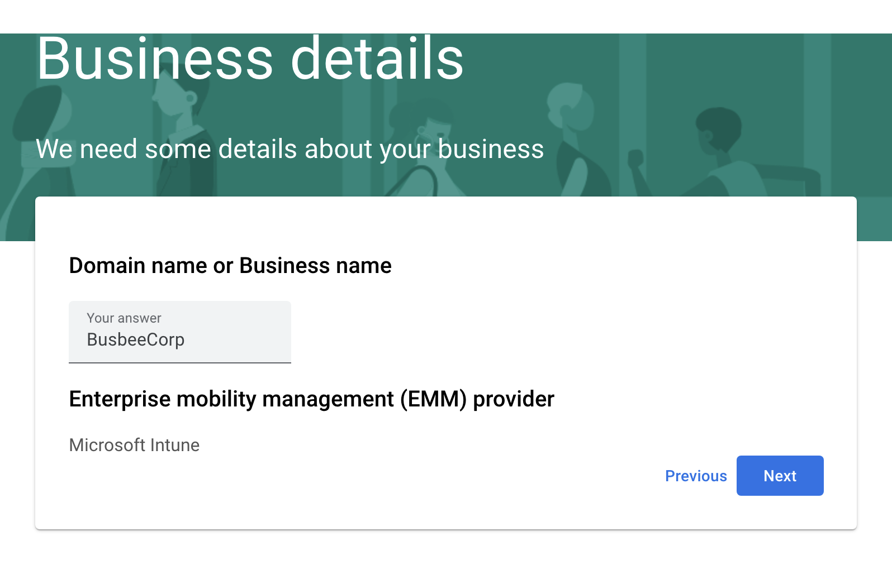
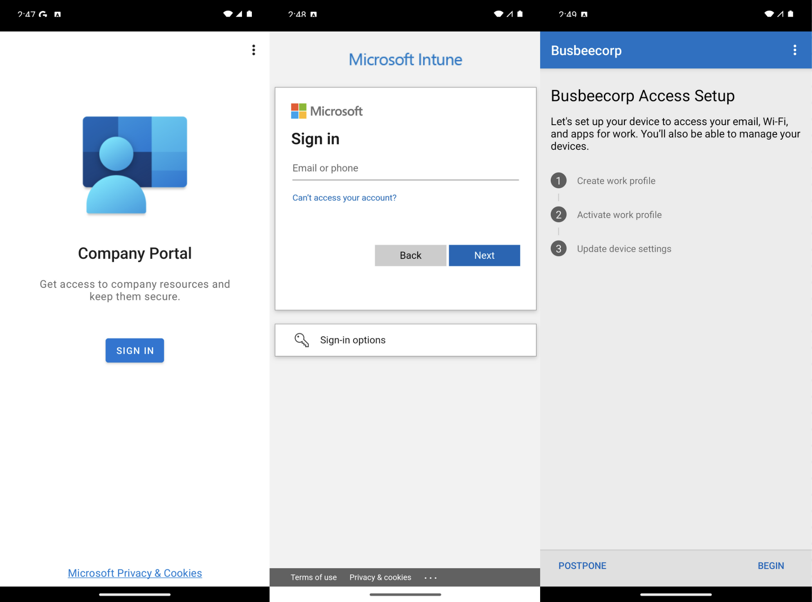

# Previous: [[7. Enrolling iPhones]]

# Benefits of Managed Androids

Intune allows you to enroll and manage other devices beyond just Windows 11. With some additional setup, you can connect Apple iPhone and Google Android devices. In this section I will show how to connect a Managed Google Play account to Intune. 

# Managed Google Play

To make the connection just go to `Intune > Devices > Enrollment >  Android > Managed Google Play` which will open a blade allowing you to give permission to Intune to connect to Google Play then a button to log in with a Google account.

In a real scenario you would want to use a secure Google account managed by the organization but for the purposes of this lab I think it will be fine to just use a personal account. It will warn you that using a personal account limits you to Android only but this is fine since we don't plan on doing anything with Chromebooks or Google Workspace in this lab.

After logging in you should see a splash screen. Click the Get started button. Next it will ask for your Company name, here you can just put the name of your fake organization as well as your contact info when it asks for company officers.

If everything worked correctly you should be able to go back to the Managed Google Play screen and see a successful Setup Status.

# Testing Enrollment

To test enrollment I grabbed a virtual android install from the Android Studio and once it finished setting up I went to the Google Play Store and downloaded the Intune Company Portal app. 

When the app finishes downloading, open it and sign in with an organization account. It will then give you a rundown of what goes into enrolling the device with Intune.

When you click begin it will give you an outline of what the organization is and is not able to see through this Intune Company Portal connection. Click Accept & Continue.

Once you move on from this page you will be shown another screen explaining that your work and personal apps will now be separated. Apps for work will now come with a briefcase icon in the bottom right corner to differentiate themselves. In the app drawer you will now see two separate folders to separate Personal and Work apps. You can click the Google Play for Work icon to see apps provided by the organization available for download.

# Next: [[9. Monitoring and Reporting]]
