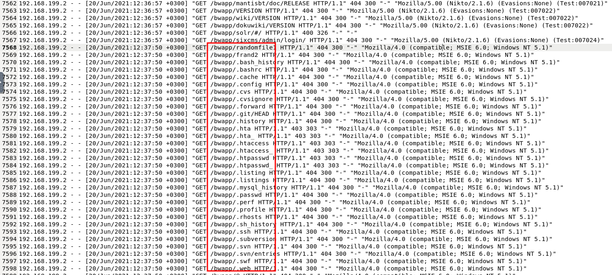
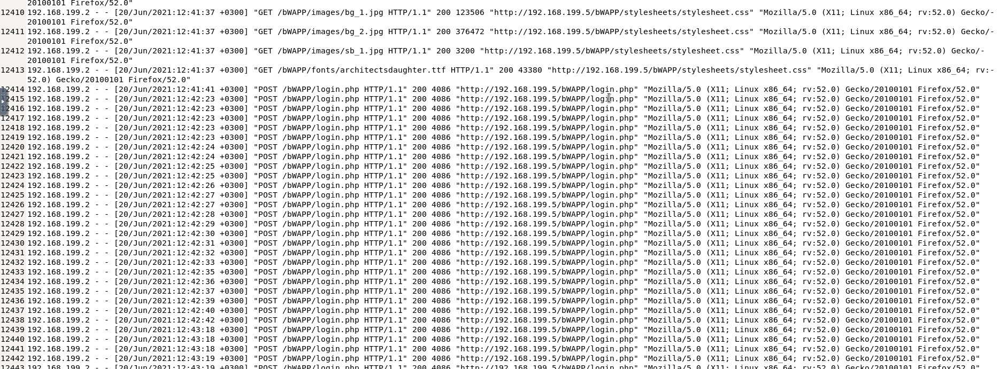

Challenge Link: https://app.letsdefend.io/challenge/investigate-web-attack
Challenge File: `/root/Desktop/ChallengeFile/access.log`
## Question 1
Which automated scan tool did attacker use for web reconnaissance?

The file for this challenge was an access.log file full of network events. I scanned through this file in the text editor, paying attention to the user-agent section of the logs. Here I found several references to Nikto which can be used to scan networks.

Answer:

`Nikto`

## Question 2
After web reconnaissance activity, which technique did attacker use for directory listing discovery?

I had to scroll down a long ways to stop seeing references to Nikto. Then I started noticing it brute-forcing common files and directories in this `/bwapp/` directory.

Answer:

`directory brute force`

## Question 3
What is the third attack type after directory listing discovery?

After running through possible directories, it seemed the attacker found a login page at `/bWAPP/login.php`. I could see them attempting the login several different times in rapid succession indicating a brute force attack.

Answer:

`brute force`

## Question 4
Is the third attack successful?

It appears the third attack was successful because eventually the logs go from accessing `/bWAPP/login.php` to seeing `/bWAPP/portal.php`, indicating a successful login.

Answer:

`Yes`

## Question 5
What is the name of fourth attack?

Further down in the logs I saw that the attacker discovered the `/bWAPP/phpi.php` page had a variable called `message` that accepted input through the GET request: `/bWAPP/phpi.php?message=` 

This indicated the attacker discovered a way to inject code to the PHP webpage.

Answer:

`code injection`

## Question 6
What is the first payload for 4th attack?

The first payload attempted after running a test was `whoami`.

Answer:

`whoami`

## Question 7
Is there any persistency clue for the victim machine in the log file ? If yes, what is the related payload?

After the whoami, the attacker sent another payload.

When I ran this through CyberChef for URL Decode I got this:

It looks like the attacker tried to add a user to the system, likely an attempt at persistence. 

Answer:

`%27net%20user%20hacker%20Asd123!!%20/add%27`
