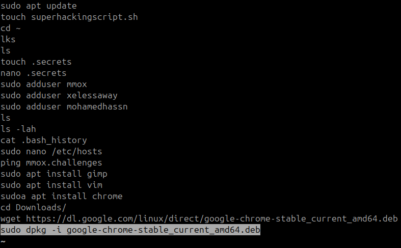
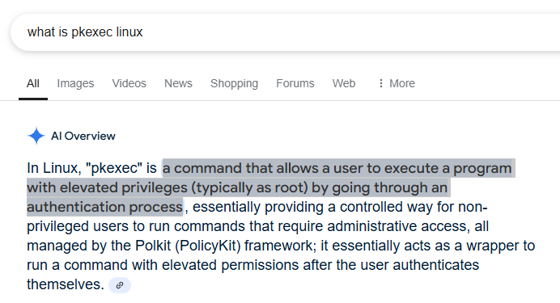
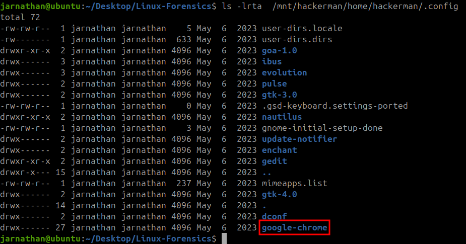
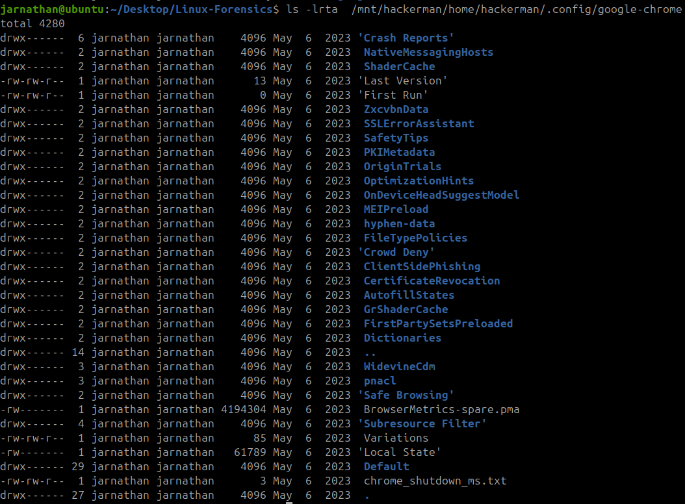
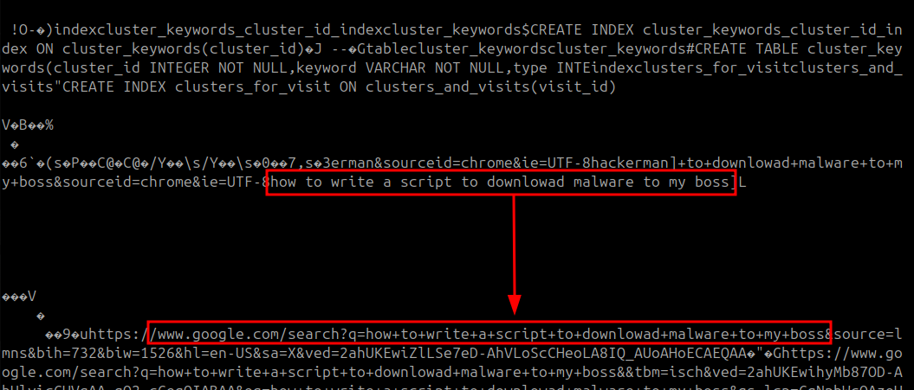
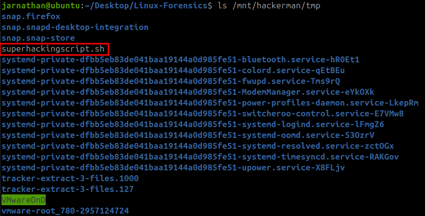

Challenge Link: [https://app.letsdefend.io/challenge/linux-forensics](https://app.letsdefend.io/challenge/linux-forensics)

Scenario:

```
An ex-employee, who appears to hold a grudge against their former boss, is displaying suspicious behavior. We seek assistance in uncovering their intentions or plans.
```

Image file location: /home/analyst/hackerman.7z
Or directly download: [https://letsdefend-images.s3.us-east-2.amazonaws.com/Challenge/Linux-Forensics/hackerman.7z](https://letsdefend-images.s3.us-east-2.amazonaws.com/Challenge/Linux-Forensics/hackerman.7z)
## Setup

To get started, I would first have to download and mount the `.img` file to my Ubuntu system. I did so using the following commands:

```
cd ~/Desktop
mkdir Linux-Forensics && cd Linux-Forensics
wget https://letsdefend-images.s3.us-east-2.amazonaws.com/Challenge/Linux-Forensics/hackerman.7z # Download the zip file
7z x hackerman.7z # Extract the file from the zip
rm hackerman.7z
sudo mkdir /mnt/hackerman# Create location for the mounted disk
sudo kpartx -av hackerman.img # Output name of device under /dev/mapper. For me this was loop15p3
sudo mount /dev/mapper/<loop number> /mnt/hackerman# Mount this device to /mnt/img
ls /mnt/hackerman
```

Once the `.img` file mounted I was able to see its file structure in `/mnt/hackerman` . If the folder is empty you may have done something wrong and need to take a look at the steps.


> To remove the device when analysis is done: `sudo kpartx -d hackerman.img` 
## Question 1
What is the MD5 hash of the image?

I used the following command to find the MD5 hash:

```
md5sum ~/Desktop/Linux-Forensics/hackerman.img
```

Answer:

`6be42bac99e0fff42ca9467b035859a3`
## Question 2
What is the SHA256 hash of the file in the "hackerman" desktop?

To answer this I would have to find the file on hackerman's desktop. I found a `hackerman.jpeg` at `/mnt/hackerman/home/hackerman/Desktop` and used the following command to find the SHA256 hash:

```
sha256sum 
/mnt/hackerman/home/hackerman/Desktop/hackerman.jpeg
```

Answer:

`3c76e6c36c18ea881e3a681baa51822141c5bdbfef73c8f33c25ce62ea341246`

## Question 3
What command did the user use to install Google Chrome?

In Linux, the history of recent commands run by a user is saved in the `.bash_history` folder in each user's home directory. To list the contents of this file for the "hackerman" user I ran the following command:

```
less /mnt/hackerman/home/hackerman/.bash_history
```



It appeared the user made several attempts to download and install google chrome.

Answer:

`sudo dpkg -i google-chrome-stable_current_amd64.deb`
## Question 4
When was the Gimp app installed? Answer format: yyyy-mm-dd hh:mm:ss

To find the exact time Gimp was installed I would need to check the apt history located at `/var/log/apt/history.log`. I used the following command to find Gip in this file and output the line before and after it.

cat /mnt/hackerman/var/log/apt/history.log | grep "apt install gimp" -A 1 -B 1

- `grep` - to search for the keywords "apt install gimp"
- `-A 1` - Shows 1 line before the discovered line
- `-B 1` - Shows 1 line after the discovered line
  


Answer:

`2023-05-06 10:49:42`

> Note: I discovered when copy/pasting this from the terminal that the apt history puts an extra space between the date and time that Lets Defend question does not like. Remove it to get the answer to work.

## Question 5
What is the hidden secret that the attacker believes they have successfully concealed in a secret file?

Earlier in the investigation, while looking for the bash history I found a hidden file called `.secrets` saved in the "hackerman" user folder. Running `cat` on this file gave me this output:


Answer:

`I_want_to_hack_my_Boss`
## Question 6
What was the UUID of the main root volume?

To get this I had to do some research and found from a stack exchange page: [https://unix.stackexchange.com/questions/658/linux-how-can-i-view-all-uuids-for-all-available-disks-on-my-system](https://unix.stackexchange.com/questions/658/linux-how-can-i-view-all-uuids-for-all-available-disks-on-my-system) that UUID can be found in the `/etc/fstab` file.

```
cat /mnt/hackerman/etc/fstab
```

There were two UUIDs listed in the file. The one next to the `/` signifying the root file seemed to be the answer.


Answer:

`29153a2e-48a7-4e89-a844-dfa637a5d461`
## Question 7
How many privileged commands did the user run?

I did some researching and discovered the log of privileged commands could be found at `/var/log/auth.log` so I ran `cat` on it to take a look at the output. I noticed that a lot of lines had a `COMMAND=` section that seemed to log the actual command used. I ran my command again and `grep`'d  to search for the keyword "COMMAND="

This created several lines showing various commands. In this output I noticed there was a column that had either `sudo` or `pkexec` listed for each command.


Per Google AI Overview, `pkexec` is: "a command that allows a user to execute a program with elevated privileges (typically as root) by going through an authentication process." Looking back at the lines that include `pkexec` also have `USER=root` listed which would indicate these commands were run with root access.



Since it seemed all of the commands I listed previously were run with privileged access, all that was left to do was count the number of output lines. The command that ultimately provided my answer to this question is listed below:

```
cat /mnt/hackerman/var/log/auth.log | grep "COMMAND=" | wc -l
```

Answer:

`14`
## Question 8
What is the last thing the user searches for in the installed browser?

Considering the previous question showed the user had installed chrome at some point I assumed this was the browser in question. I had to do some research to try to find a default install location for chrome... which came back empty. I did however discover that applications installed manually by a user can sometimes have information about them in `~/.config` for that user. Sure enough when searching through `/mnt/hackerman/home/hackerman/.comfig` gave me a folder called `google-chrom`.



Listing the contents of this `google-chrome` folder did not immediately result in anything useful. There were several different sub-folders that did not seem to be related to search history information.


I took my search another level deeper and searched the contents of the `Defaults` folder. In here I found a few files related to "History" that I thought may mean I'm on the right track.



The `History` file contained a lot of unreadable characters that initially had me thinking I would need a special application to read it. Before things got that far, I scanned near the bottom of the file and found a string of readable text that corresponds to a google search URL with the same text. I was pretty sure this was my answer.

Answer:

`how to write a script to downlowad malware to my boss`
## Question 9
From Q8 we know that the user tried to write a script, what is the script name that the user wrote?

Now I needed to find the location where the user saved the script file they were researching. I searched several folders in the user's home folder as well as around the file system such as `/opt` to no avail until I finally found something useful in the `/tmp` folder.



This looked rather suspicious...
  
Answer:

`superhackingscript.sh`
## Question 10
What is the URL that the user uses to download the malware?

Now I needed to analyze the contents of the `superhackingscript.sh`. I used the `less` command to see what was written.


The script gives us the malicious URL right at the beginning.

Answer:

`https://mmox.me/supermalware`
## Question 11
What is the name of the malware that the user tried to download?

Also in the malicious script is a line with a reference to a `DESTINATION` variable that contains the string `ed6baf485cde6e94caa8326b91d323dbc53af58e954520ee55fed80b044c1985`. Since this caught my eye and seemed to be a hash value, I searched it on VirusTotal. I discovered it is a hash of a Mirai trojan.


Answer:

`mirai`
## Question 12
What is the IP address associated with the domain that the user pinged?

It seemed the easiest way to find the answer to this was to go back and check the `.bash_history` again for a reference to `ping`. I used the following command:

```
cat /mnt/hackerman/home/hackerman/.bash_history | grep "ping"
```

Which gave me one result: `ping mmox.challenges`


`.challenges` did not seem to be a legitimate TLD so I figured it may have been manually created in the `/etc/hosts` file.


My suspicion was confirmed when I found `mmox.challenges` listed in the file.

Answer:

`185.199.111.153`
## Question 13
What is the password hash of the "hackerman" user?

The easiest way to find the password hash is to check the `/etc/shadow` file for the specific user. In this case I used the following command:

```
cat /mnt/hackerman/etc/shadow | grep "hackerman"
```

This gave the following output for the user "hackerman":


The hash is the second field between the semi-colons.

Answer:

`$y$j9T$71dGsUtM2UGuXod7Z2SME/$NvWYKVfU9fSpnbbQNbTXcxCdGz4skq.CvJUqRxyKGx6`