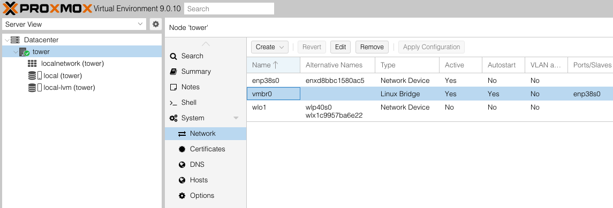
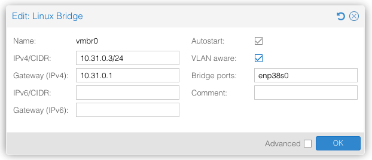
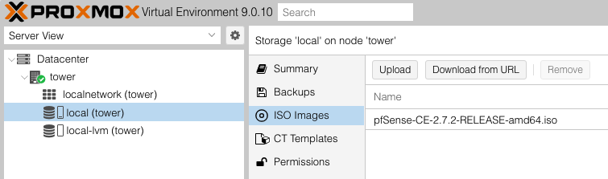
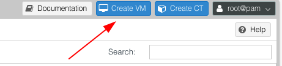
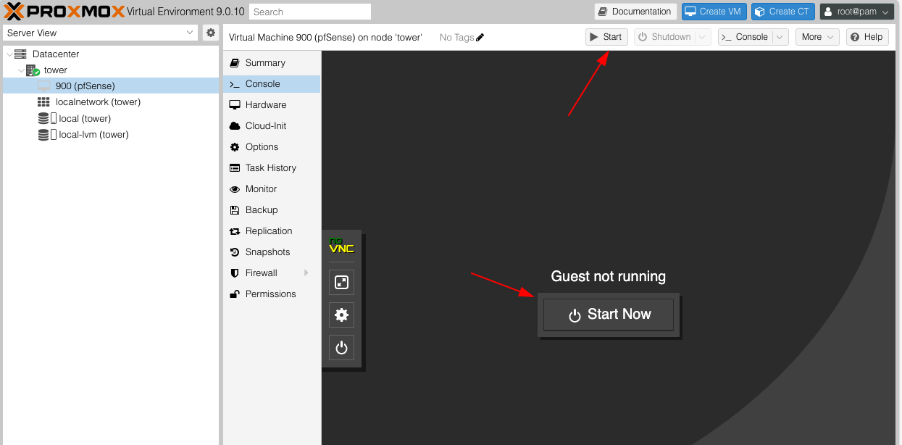
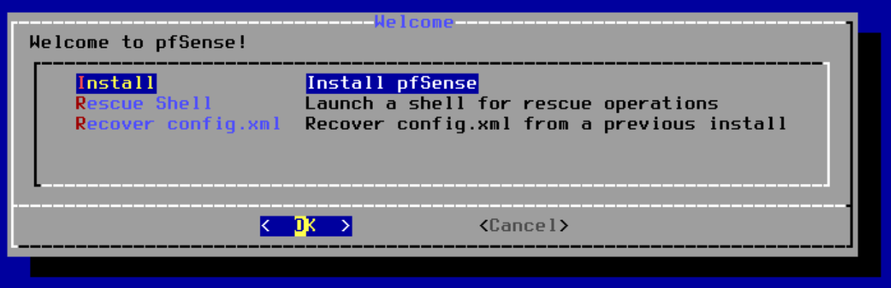
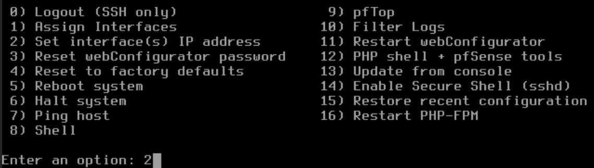
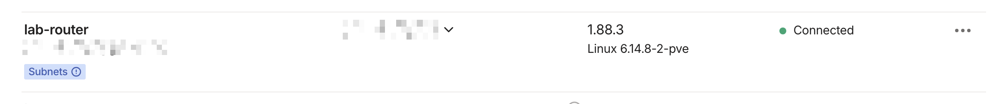
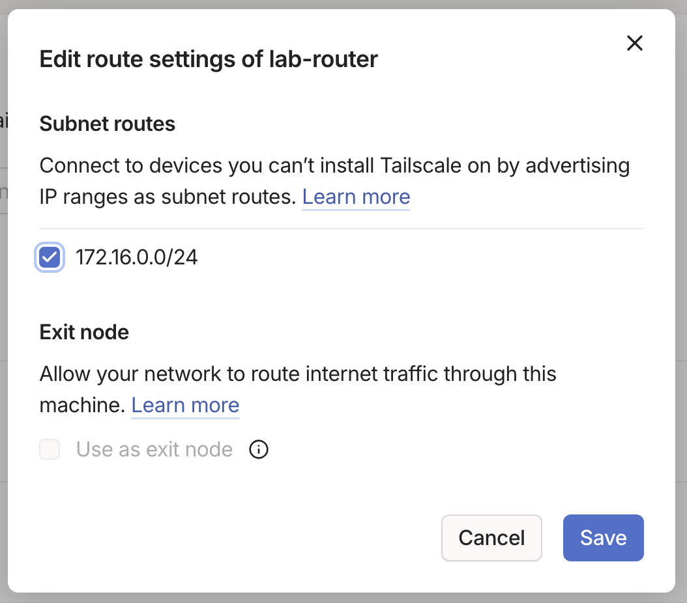

# Proxmox

Proxmox is a free and open source type 1 hypervisor that is popular with home lab builders. It is a Debian Linux based OS that can be installed on almost anything, although your mileage may vary depending on the strength of the hardware you give it. In my case I will be installing on my desktop PC that I was previously using for gaming. 

I won't go into the specifics of how to install Proxmox, but you basically just download and install the Proxmox ISO to a flash drive and plug it into your computer. If you don't know what you're doing here just look up a video.

## Updating Proxmox

First make sure Proxmox is up to date. Open a new shell console by clicking on your PVE Node and selecting Shell. You will likely need to disable the subscription update sources and create a source list for no-subscription updates. This can be done with the commands below:

```
sed -i '1s/^/Enabled: no\n/' /etc/apt/sources.list.d/pve-enterprise.sources
sed -i '1s/^/Enabled: no\n/' /etc/apt/sources.list.d/ceph.sources    # if you’re not using Ceph

cat > /etc/apt/sources.list.d/proxmox.sources <<'EOF'
Types: deb
URIs: http://download.proxmox.com/debian/pve
Suites: trixie
Components: pve-no-subscription
Signed-By: /usr/share/keyrings/proxmox-archive-keyring.gpg
EOF
```

Now you can update and reboot Proxmox with the following commands:

```
apt update && apt full-upgrade -y
reboot
```

## Tweaking Network Settings 

Now that Proxmox is updated we need to make a lab sub network that is isolated from the main home network that Proxmox sits on. Click `Datacenter > [Node] > Network` to get network settings for the current Proxmox node. We will want to make sure we have two bridges, `vmbr0` and `vmbr1` which will be the bridge to our outside and inside networks respectively.



> Note: I have chosen to call my node "tower"

First we want to make sure `vmbr0` exists and is set to VLAN aware: `Yes`. To make changes to the bridge just double click it, then check the box for VLAN aware.



Next we will need to create the a new bridge for `vmbr1`. For this one, we will want to use an Open vSwitch bridge instead of the default Linux Bridge because this interface will be getting mirrored to another interface `vmbr2` later on in the Security Onion section. 

First go to `Datacenter > [Node] > Shell` and run the following commands to install Open vSwitch:

```
apt update
apt install openvswitch-switch
```

Now just click `Datacenter > [Node] > Network > Create > OVS Bridge` to open up the create wizard. The name should autofill to `vmbr1` but you will also need to make sure to click the VLAN Aware checkbox in this one as well. All other fields can be left blank. Once that is done save the settings by clicking Apply Configuration on the top of the Network config page.

# pfSense

pfSense is a free and open-sourced software that can operate as a router and firewall once installed on hardware. For our purposes, we can use it to create a walled-off network environment for the security lab. All of our devices will be connected to the PFSense router and PFSense will decide what connections are allowed.

## Downloading ISO

To download the PFSense ISO to Proxmox via the console run the following commands:

```
mkdir -p /var/lib/vz/template/iso
cd /var/lib/vz/template/iso
wget https://kr2.mirrors.naho.moe/naho/pfSense/2.7.2/pfSense-CE-2.7.2-RELEASE-amd64.iso.gz
gunzip pfSense-CE-2.7.2-RELEASE-amd64.iso.gzls
```

Once that is downloaded and unzipped you can go to `Datacenter > [Node] > local ([Node]) > ISO Images` where you can verify the ISO is recognized by Proxmox.



Now this ISO can be used to create a new pfSense VM.

## Create VM

To get started creating the pfSense VM you just have to click the Create VM button in the top right of the Proxmox portal.



This will open a pop-up Create: Virtual Machine wizard you can use to tweak the details of the VM before installing it. I will use the following settings to create one for pfSense:

- General Page
	- **VM ID**: 900
	- **Name**: pfSense
- OS Page
	- **ISO**: Select the ISO disk from previous step
- System Page
	- **Machine**: Default (i440fx)
	- **BIOS**: Default (SeaBIOS)
	- **SCSI Controller**: VirtIO SCSI single
- Disks Page
	- **Size**: 20GB
	- **Cache**: Write back
- CPU Page
	- **Cores**: 2
	- **Type**: host
- Memory Page
	- **Memory (MiB)**: 2048
- Network Page
	- **Bridge**: vmbr0
	- **Model**: VirtIO (paravirtualized)
	- **Firewall**: Checked

Before starting up the pfSense VM we need to add another network interface so the router has a WAN and LAN port. Go to `Datacenter > [Node] > pfSense > Hardware > Add > Network Device` and give it the following settings:

- **Bridge**: vmbr1
- **Model**: VirtIO (paravirtualized)
- **Firewall**: Checked

## Installing and Configuring

Now you can start the pfSense VM by going to `Datacenter > [Node] > pfSense > Console` and clicking the Start Now button, or by clicking the Start button in the top right corner of Proxmox when pfSense is selected.



You will get to an installer that will guide you through the pfSense VM install.



When prompted for partitioning select Auto (UFS) > Entire Disk > MBR > Finish > Commit to allow the installer to build the file system and boot manager. Once it gets to the end it will ask to reboot. Confirm the request and wait for the VM to come back online.

After booting up, pfSense will ask a few questions:
- Should VLANs be set up now? -> n
- Enter the WAN interface name -> vtnet0
- Enter the LAN interface name -> vtnet1

pfSense will spin up and begin configuring itself. Once its done you will see a CLI menu of options. Select `2) Set interface(s) IP address` so we can update the interfaces.



Make the following changes within this menu:

- WAN
	- IPv4: DHCP
	- IPv6: DHCP
	- Revert to HTTP as webConfigurator: n
- LAN
	- IPv4: Static
	- IPv4 Address: 172.16.0.1/24
	- Enable DHCP on LAN: y
	- Start Address: 172.16.0.100
	- End Address: 172.16.0.200
	- Revert to HTTP as webConfigurator: n

Once this is done you will be brought back to the pfSense console menu. You can test the connection on the WAN side by choosing option 8 to open a shell interface and running `ping -c 3 8.8.8.8` to ensure you are able to send and receive packets. If it fails here something did not set up correctly in the previous steps.

## GUI Setup Wizard

Open the pfSense portal from the WAN side. 

```
pfctl -d
```

Navigate to the WAN ip address in your browser to find the pfSense login window. Use the default login `admin:pfsense` to get in. You will get thrown into a setup wizard you will need to complete for pfSense to work correctly. Most settings will be left at default but it will ask you to create a new admin password. Do that, then let it reboot.

After reboot, you will need to run `pfctl -d` in the shell again before you will be able to access the web portal again. 

Now go to `Services > DNS Resolver > Access Lists` and create a new list for the network `172.16.0.0/24` (Or whatever you made your lab network). 

## Firewall Rules

Now we need to set some rules on the firewall so that none of the malware we run within the pfSense LAN network can escape out to the outer network. First we will create an alias for the Home network so it is easier to build the rules. Go to `Firewall > Aliases > Add` and give it a name of `HOME_LAN` and set it to the IP address of your Home network, which will likely be something like 192.168.0.0/24. Make sure to select Apply Changes when done to save the settings.

Next go to `Firewall > Rules > LAN` and delete all rules except for the Anti-lockout Rule. Then create two new rules based on the following table:

| Order | Action | Protocol | Source      | Destination | Notes                                         |
| ----- | ------ | -------- | ----------- | ----------- | --------------------------------------------- |
| 1     | Pass   | Any      | LAN subnets | !`HOME_LAN` | Allows traffic not destined for home network  |
| 2     | Block  | Any      | LAN subnets | `HOME_LAN`  | Blocks anything heading towards home network. |

>Note: The `!` in Rule #1 is achieved by checking the box for "invert match". Also make sure the Pass rule is above the Block rule or traffic will fail to travel.


# Tailscale 

Now that I have pfSense up and running, any new VM I create for the lab will connect to the pfSense LAN interface rather than the Proxmox interface. This way, all lab devices are contained within their own network and segregated from the main home network it sits within. However, once the network is walled off we will need a way to connect to it. 

My plan is to create a small Tailscale VM, set it to advertise the pfSense LAN network, then set ACL rules to keep it separated from my Home Network.

> My setup will have two Tailscale VMs, one on the home network advertising the home subnet, and another on the lab network advertising the lab subnet. This way I can remotely connect to both networks without them bleeding into each other. My instructions will assume you want to set it up this way and have the home Tailscale VM already setup. You can repeat the instructions here to setup both. 

## Create The VM

This time I will use a container instead of a VM due to being a little more lightweight. Proxmox makes it easy by having container templates available for download and use. To download a new container template go to `Datacenter > [Node] > local ([Node]) > CT Templates > Templates`. This will popup a window where you can select `debian-12-standard` from the list and click Download to get the template.

Now create the new container by clicking Create CT in the top right of Proxmox. I used the following settings in the wizard to create the container:

- **CT ID**: 901
- **Hostname**: Tailscale-Lab
- **Unprivileged container**: Unchecked
- **Template**: Debian 12
- **Disk / RAM / CPU**: 4GB / 256MB / 1 Core
- **Network**: Bridge=vmbr1, IPv4=DHCP

Before starting the container you will need to open the Proxmox host shell and enter the following command to bind the host /dev/net/tun folder to the Tailscale container /dev/net/tun. This is the recommended solution when running Tailscale through Proxmox.

```
cat >> /etc/pve/lxc/901.conf <<'EOF'
lxc.cgroup2.devices.allow: c 10:200 rwm
lxc.mount.entry: /dev/net/tun dev/net/tun none bind,create=file
EOF
```

> Note: For the Tailscale-Home router you will want to use a different container ID (I chose 101) and Bridge=vmbr0. Make sure to change the CTID in the command above as well.

## Installing Tailscale

Once that's done you can start up the container then access it from the console by going to `Datacenter > [Node] > Tailscale-Lab > Console` and use the terminal to log into the `root` user with the password chosen at setup. After login we need to run these commands to update and install Tailscale.

```
apt update && apt upgrade -y
apt install curl -y

mkdir -p --mode=0755 /usr/share/keyrings
mkdir /dev/net/   
mkdir /dev/net/tun

curl -fsSL https://pkgs.tailscale.com/stable/debian/bookworm.noarmor.gpg | tee /usr/share/keyrings/tailscale-archive-keyring.gpg >/dev/null

echo "deb [signed-by=/usr/share/keyrings/tailscale-archive-keyring.gpg] https://pkgs.tailscale.com/stable/debian bookworm main" | tee /etc/apt/sources.list.d/tailscale.list

apt update

apt install -y tailscale
systemctl enable --now tailscaled
systemctl start tailscaled
```

These commands do the following:
- Updates the container and install curl
- Creates new folders for keys and 
- Downloads the key and adds tailscale's repo
- Updates the container again and installs tailscale
- Enables Tailscale service

## Advertising Subroutes

Next we will need to advertise the pfSense LAN network via Tailscale so that the devices within the LAN are accessible via the Tailscale VPN. 

First we need to enable forwarding within the container. In the Tailscale CT Shell run these commands to enable the forwarder and make it persistent across sessions.

```
echo 1 > /proc/sys/net/ipv4/ip_forward
echo "net.ipv4.ip_forward=1" >> /etc/sysctl.conf
```

Next we need to run the `tailscale up` command and feed in the IP address of the pfSense LAN:

```
tailscale up --advertise-routes=172.16.0.0/24 --accept-dns=false --hostname=lab-router
```

> Note: For the Tailscale-Home router you would want to use the HOME_LAN ip address here. 

This installer will spit out a URL for Tailscale. Copy/paste this into your browser and login with your Tailscale account. After successfully connecting you will be redirected to the Tailscale management dashboard. Here you can see the device you just connected.



One last thing we need to do is click the 3-Dot button to the right of the device and select `Edit route settings`. This will pop up a window where you will need to check the box next to the IP address of the pfSense LAN network.



Click save to confirm the settings.

## Testing Configuration

Now that everything is in place, your Tailscale-Lab container should be able to ping every IP address except for those within your home network. This ensures your network is safe from anything you decide to run within the lab. You can verify connectivity with a few commands:

```
ping 172.16.0.1 # Should pass
ping 8.8.8.8 # Should pass
ping google.com # Should pass
ping [HOME_LAN] # Should fail
```

If these tests work out we should be good to move on. 
