Now that we have gotten a lot of the initial foundation done we have a place to build our lab environment in. On this page I am going to walk through setting up Windows in our lab environment. I am going to start with a Windows Server 2025 VM, promote it to domain controller, and join a Windows 11 workstation machine to it to simulate a small office environment. Later on I will install network sensors and feed logs up into a SIEM so we can do some real security stuff.

# Windows Server

Microsoft developed Windows Server as a solution to manage organization's Active Directories, DNS, DHCP, Group Policy all from a centralized location. You can set servers to act as Domain Controllers, Certificate Authorities and other important network appliances to organize company data and digital environments. In our case we will use it mainly as an Domain Controller so we can have an Active Directory domain in an attempt to simulate a real organization. 

## Download & Install

As with any virtual machine in Proxmox, setting it up begins with loading the ISO file into the hypervisor so it can be used to install the machine. To download Windows Server 2025 to our proxmox machine I am going to use the following commands:

```
STORAGEPATH="/var/lib/vz/template/iso"
ISO_URL="https://go.microsoft.com/fwlink/?linkid=2293312&clcid=0x409&culture=en-us&country=us"
wget -c -L -O "${STORAGEPATH}/WinSrv2025_EVAL_en-us.iso" "${ISO_URL}"
```

To confirm the download was successful I can go to `Datacenter > [Node] > local([Node]) `. Here we can see it downloaded into our ISO bin.

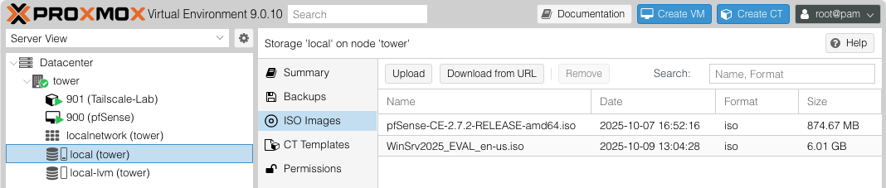

Confirm you see the ISO here, then click the Create VM button in the top right corner of the Proxmox portal to open the Create VM wizard again. I'm going to give the server install these values:

- **VM ID**: 902
- **Name**: WinServer-Lab
- **Guest OS Type**: Microsoft Windows
- **Disk size**: 60
- **CPU Cores**: 4
- **Memory**: 6144
- **Bridge**: vmbr1

Once these settings are in place and the VM is built, go ahead and turn it on. You will need to go to `Datacenter > [Node] > WinServer-Lab > Console` to view the Windows installation wizard. 

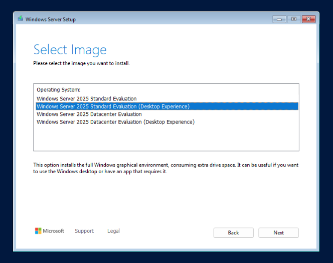

Make sure to select the Standard Evaluation (Desktop Experience) version of the install. Click Next, Accept the licensing terms, then choose the hard drive it will install on. There should only be the 60 GB VM drive we created earlier.

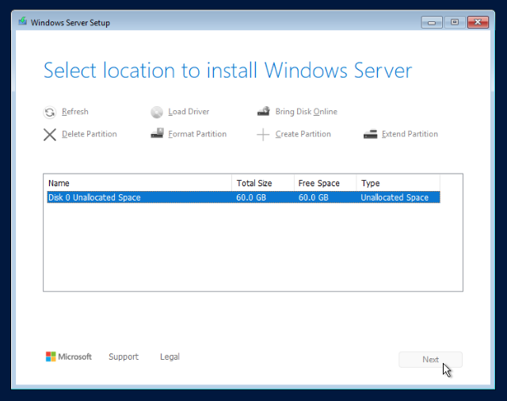

Once the installer kicks off you can sit back and let Windows do its thing for a few minutes. Eventually you will be prompted to enter an Administrator password. Create a secure one, then log into the machine. With Proxmox you may need to use the NoVNC sidebar to send the CTRL+ALT+DEL button presses to the machine. 

Once logged in, open Command Prompt and run a ping to the pfSense router IP to make sure it is connected correctly.

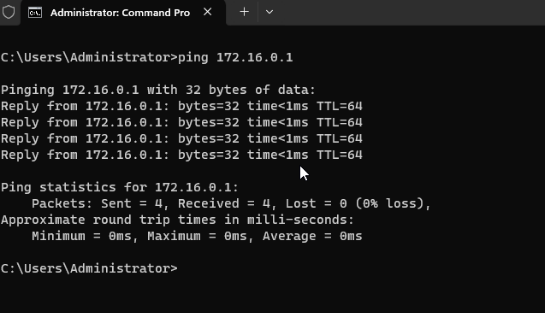

## Lab Config

Now that the Windows Server is up and running there are a few settings we need to change. For the server to operate effectively it will need to have a static IP address. We also want RDP and WinRM turned on so that we can connect to the server via remote desktop. 

To set the static IP you just need to assign the MAC address of the Windows Server machine to the IP address you want in pfSense. First we need to grab the MAC Address by going to `Datacenter > [Node] > WinServer-Lab > Hardware > Network Device` and you can copy the address to paste into pfSense.

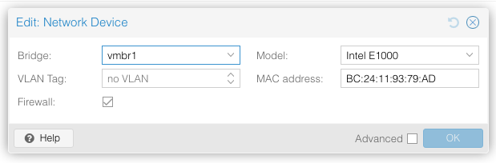

Now go back to the pfSense web portal and select `Services > DHCP Server`. Make sure the Address Pool Range is set for 172.16.0.100-200 then scroll down to the bottom of the page and click the Add Static Mapping button. Paste the MAC Address into the field where it asks for, then enter the desired IP address. 

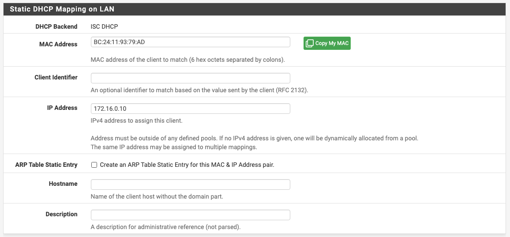

With that in place just scroll down to the bottom of the page and click Save > Apply Changes. This change will not take effect until we reboot our Windows Server VM, but first lets enable RDP and WinRM.

To do that we need to go back into our Windows Server machine and choose `Settings > System > Remote Desktop` and change the toggle to On. Next go to `Server Manager > Local Server` and confirm that Remote management and Remote Desktop are both set to Enabled.

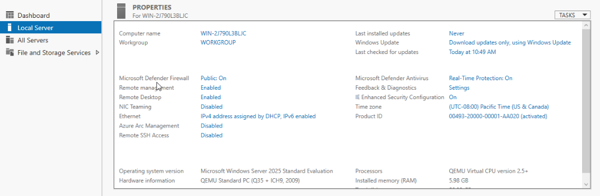

Lastly I wanted to change the name of the Windows PC. By clicking on the randomly generated name next to Computer Name you will open a window that allows you to change the name. Change it to WinServer-Lab and allow it restart when prompted.

Now that RDP is enabled I can connect to the machine using a remote desktop tool such as Microsoft's Windows App. You will need to give it the IP address of the machine as the PC name. You can also create a friendly name for it like WinServer-Lab and make it a part of a machine group to keep it organized. I would also go ahead and save the Administrator credentials for easier use.

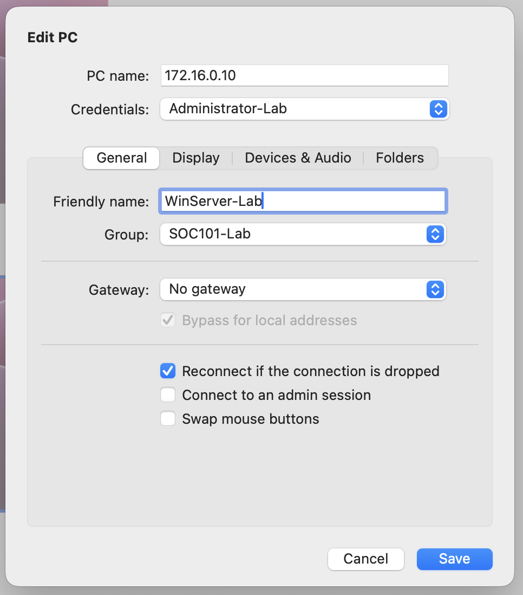

Save and connect to the machine to verify it works. Now we can copy/paste commands into PowerShell and have a little better quality of life trying to use the server.

## Domain Controller

Up next is to promote our Windows Server to a Domain Controller. In a real environment there would likely be several DC's stitched together to provide availability and redundancy for Active Directory. It allows computers to connect to the organizational domain and have access to shared resources and management. It allows users to log in with an organization domain account rather than a local account and can carry it with them from computer to computer. 

Before we get started setting that up, I want to make sure the server is fully updated by going to `Settings > Windows Update` and making sure all updates have been downloaded and installed.

With updates done we can now move on to domain controller promotion. Click `Server Manager > Manage > Add Roles and Features` to open the wizard. Click the next button a few times until you get to the Server Roles page. Look for the Active Directory Domain Services option and check the box. 

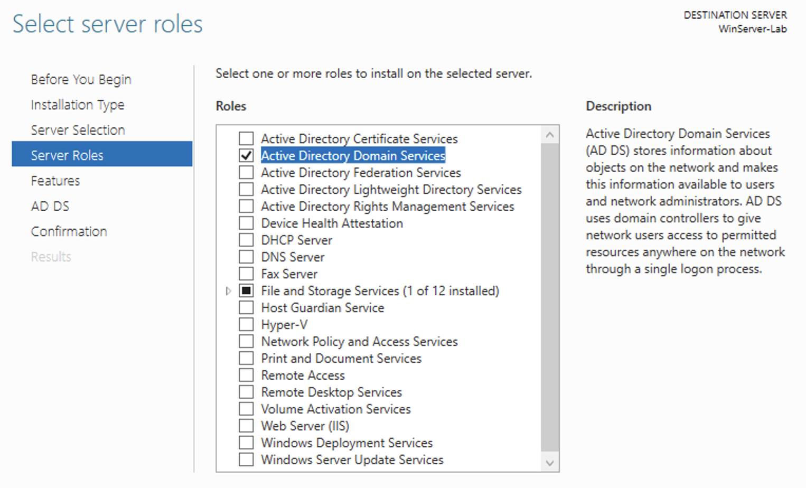

A box will pop up asking you to Add Features related to this role. Keep the defaults and click Add Features. Now keep clicking Next until you get to the end of the wizard and click Install. Windows Server will need some time to run as it installs the features and roles we selected.

Once the installation is finished close the box, then go back to the Yellow Flag icon in the top right corner of Server Manager. It will now have an option to "Promote this server to a domain controller".

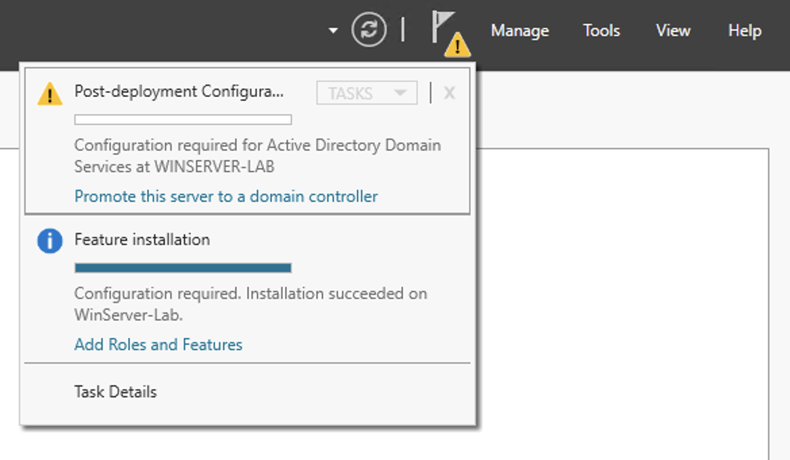

Select this option to open the Domain Services Configuration Wizard. This will let you select options to configure the domain controller. I used the following settings:

- **Add a new forest**: Checked
- **Root Domain Name**: busbeecorp.lab
- **DNS Delegation**: Ignore warning and continue
- **NetBIOS name**: BUSBEECORP
- **Prerequisite Checks**: Ignore any soft warnings here about DNS delegation or static IP

Put those settings in place then click Install to send the Windows Server off begin promoting itself to controller of the domain you built. You may notice the machine automatically reboot during this process. You can confirm the promotion took effect by going to `Server Manager > Tools > Active Directory Users and Computers`. If this page opens without error you should be good. 

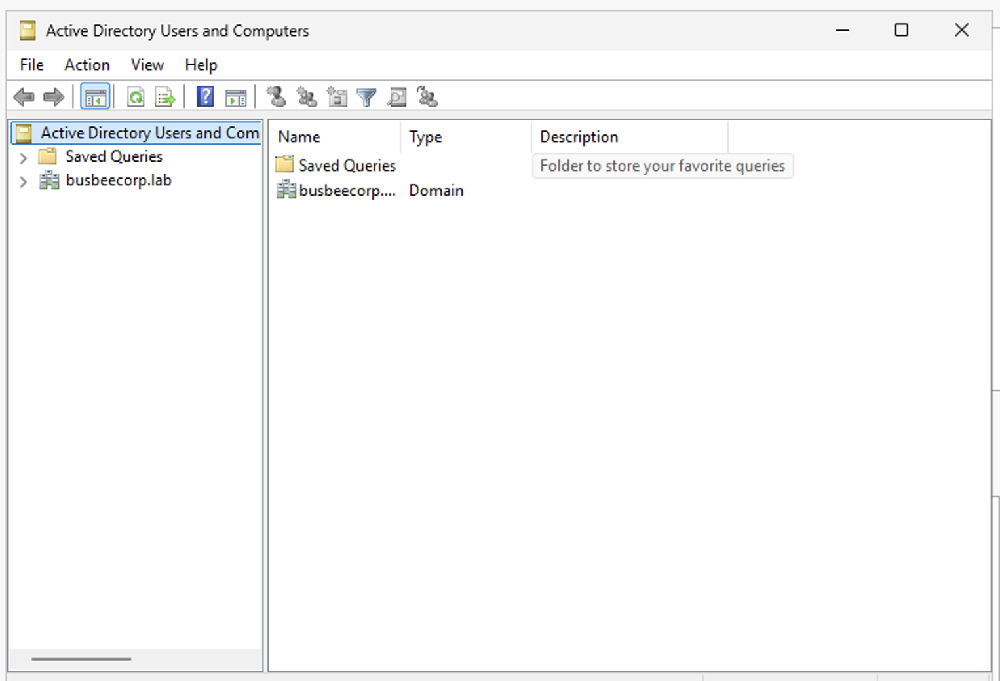

## Create Users

While in here we can make some users for our lab environment. Just go to `Users > New > User` which will pop up a new window to create a user. 

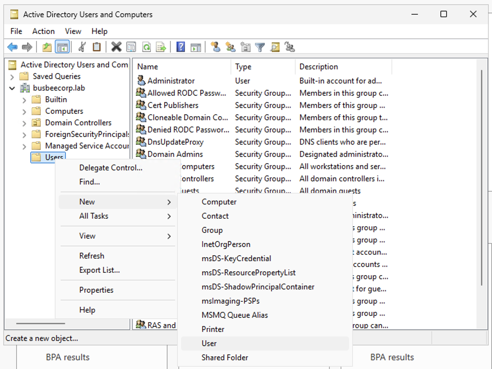

I will name our first user Alice and give her a strong password.

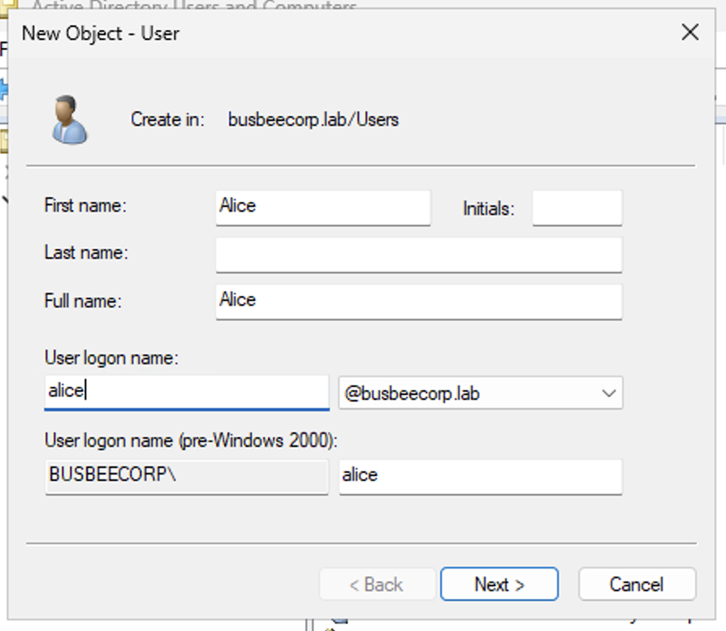

Alice will be the Domain Admin of our lab so I will add her to the Domain Admin and Administrator groups. To add a user to a group, just double-click that user then then go to the Member Of tab. Here you can type the names of the two groups and click Ok > Apply to save the settings. You should see something like this:

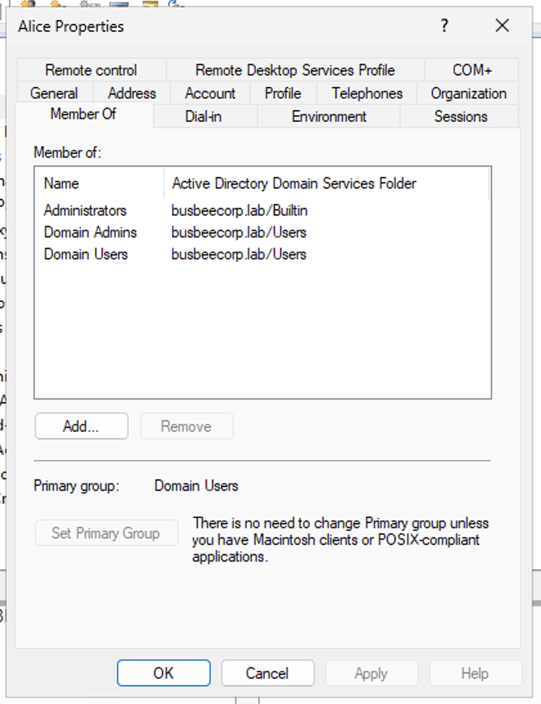

Now I will make a second user Bob, who will be our Analyst in the lab. Bob will be a member of the Domain Users and Remote Desktop Users groups. Since the first is a default group I just have to create the Bob user, then add the Remote Desktop Users group to his list of groups.

## Installing Sysmon

System Monitor aka Sysmon is a [Windows Sysinternals](https://learn.microsoft.com/en-us/sysinternals/) tool used to collect and parse detailed Windows event data. For our lab we will use it to forward event data to our Splunk SIEM. Sysmon also lets you load a config file that can be used to fine-tune the log collection. There is a well known and trusted Sysmon config file created and maintained by SwiftOnSecurity that can be found [here](https://github.com/SwiftOnSecurity/sysmon-config). 

Sysmon and the SwiftOnSecurity config file and be downloaded and installed using the following elevated (admin) PowerShell that was adapted from [ajpc500's GitHub post](https://gist.github.com/ajpc500/3a86ba1741d4868b69be5ce3a142d527):

```
[Net.ServicePointManager]::SecurityProtocol = [Net.SecurityProtocolType]::Tls12
$wc = New-Object System.Net.WebClient
if (!(Test-Path "C:\Tools")) { New-Item -Path "C:\" -Name "Tools" -ItemType "directory" }

# Download Sysmon
$SysmonDirectory = "C:\Tools\Sysmon\"
$SysmonLocalZip = "C:\Tools\Sysmon.zip"
$SysmonURL = "https://download.sysinternals.com/files/Sysmon.zip"
if (!(Test-Path $SysmonLocalZip)) {
    $wc.DownloadFile($SysmonURL, $SysmonLocalZip)
    Expand-Archive -LiteralPath $SysmonLocalZip -DestinationPath $SysmonDirectory
}

# Download SwiftOnSecurity Config
$SysmonLocalConfig = $SysmonDirectory + "sysmonconfig-export.xml"
$SysmonConfigURL = "https://raw.githubusercontent.com/SwiftOnSecurity/sysmon-config/master/sysmonconfig-export.xml"
if (!(Test-Path $SysmonLocalConfig)) {
    $wc.DownloadFile($SysmonConfigURL, $SysmonLocalConfig)
}

# Install Sysmon
$ServiceName = 'Sysmon'
$SysmonService = Get-Service -Name $ServiceName -ErrorAction SilentlyContinue
if ($SysmonService.Status -ne 'Running') {
    $SysmonExe = $SysmonDirectory + "Sysmon.exe"
    & $SysmonExe -i $SysmonLocalConfig -accepteula
}
```

Once that's done we can move on to installing the Windows 11 workstation machine. 

## Atomic Red Team
Atomic Red Team is an open-source framework for simulating MITRE ATT&CK adversary techniques via executable tests, aiding red teaming, detection engineering, and security validation. We can use it to run attacks and test our detection setup thus far. To install Atomic Red Team on the Windows Server run the following commands:

```
Set-ExecutionPolicy RemoteSigned -Scope LocalMachine
Register-PSRepository -Default
Install-Module -Name invoke-atomicredteam,powershell-yaml -Scope AllUsers
Import-Module invoke-atomicredteam
```

Verify Installation:

```
Get-Module -ListAvailable invoke-atomicredteam,powershell-yaml
```

# Windows Workstation

Our lab will need a Windows workstation machine to simulate a real environment. We want it to connect to our domain so we can log in with our domain user accounts. By now we should be familiar with the process. To start off lets download the Windows 11 ISO:

## Download & Install

```
STORAGEPATH="/var/lib/vz/template/iso"
ISO_URL="https://archive.org/download/windows-11-23h2-english-x64v2/Win11_23H2_English_x64v2.iso"
wget -c -L -O "${STORAGEPATH}/Win11_23H2_English_x64.iso" "${ISO_URL}"
```

Once downloaded, click the Create VM button and add these settings to the wizard:

- **VM ID**: 903
- **Name**: WinWS01-Lab
- **ISO**: Win11_23H2_English_x64.iso
- **Guest OS Type**: Microsoft Windows
- **Disk Size**: 64 GB
- **CPU Cores**: 2
- **Memory**: 4096 MB
- **Bridge**: vmbr1
- **Start after created**: Checked

Now go to `Datacenter > [Node] > WinWS01-Lab > Console` and walk through the Windows 11 installer. Make sure to select Windows 11 Pro so that the workstation is able to join the domain we created.

> Note: Windows 11 Home does not allow domain join and would need to be upgraded or replaced with Pro to support our needs. 

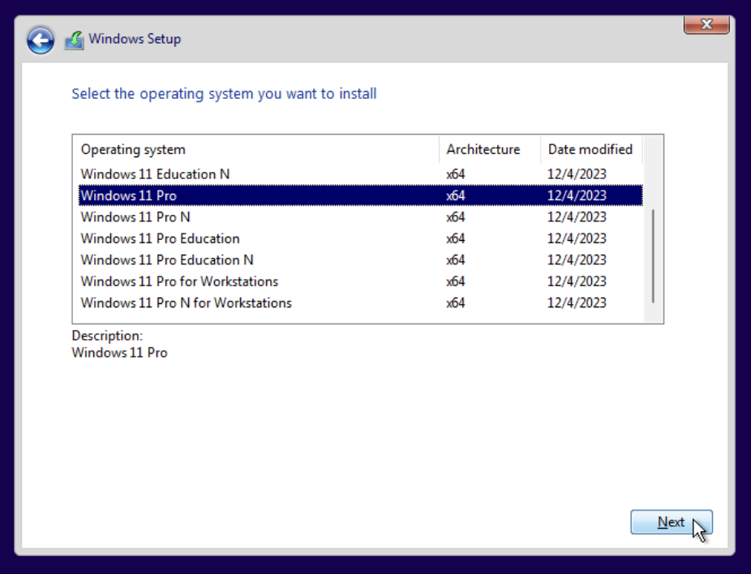

The rest of the installer is pretty straight forward. Accept the license, Choose Custom (Install Only), choose the VM hard drive as the install location, and let the installer rip. Eventually you will get to the point where it asks the user to set up their device. 

During this setup I named the computer WinWS01-Lab like its called within Proxmox. The installer will next ask if you want to set up Windows for Home or for Work/School. Choose the Work/School option.

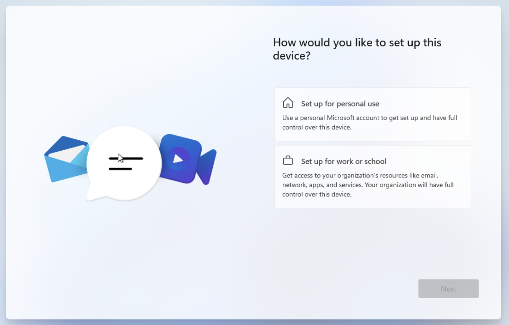

It will ask you to login with a Microsoft account. You can instead click Sign-in options > Domain join which will trigger the device to begin local account setup. We can make an account named `admin` and give it a strong password. 

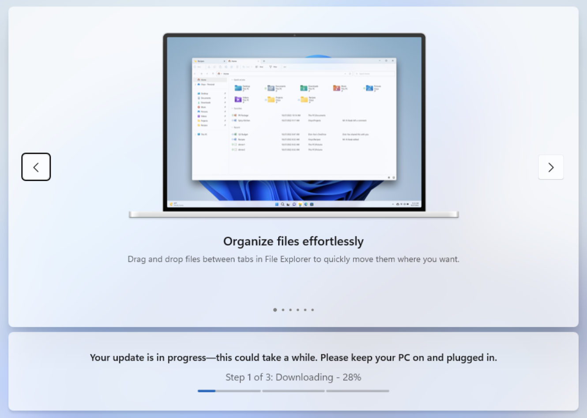

After creating the local account, the Windows installer will run a lengthy process of downloading and installing the latest updates. When this is done you will be able to log into the local account. Let's do that, then edit the Remote Desktop settings, change DNS to the Windows Server, and join the device to the domain.

## Join The Domain

Go to `Settings > System > Remote Desktop` and change the toggle to On. Here we will also need to give Bob rights to use this machine. Click Remote Desktop Users > Add and search for the bob username. You will be prompted to verify this change with a domain admin so you can use Alice's login to make this work.

Next go to `Settings > Network & internet > Ethernet > DNS Server assignment > Edit` and change the IPv4 DNS Server address to 172.16.0.10.

Once that's done, go to `Accounts > Access work or school > Connect > Join this device to a local Active Directory domain` and type in the name of the domain we set in the previous step.

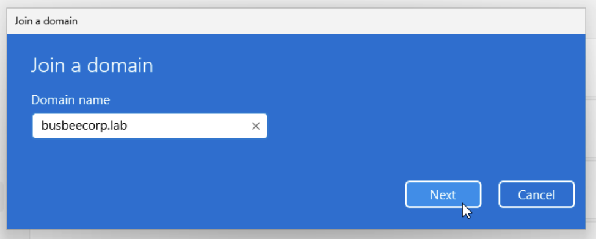

Since Alice is our only domain admin, she will have to be the one to approve this device to join the domain.

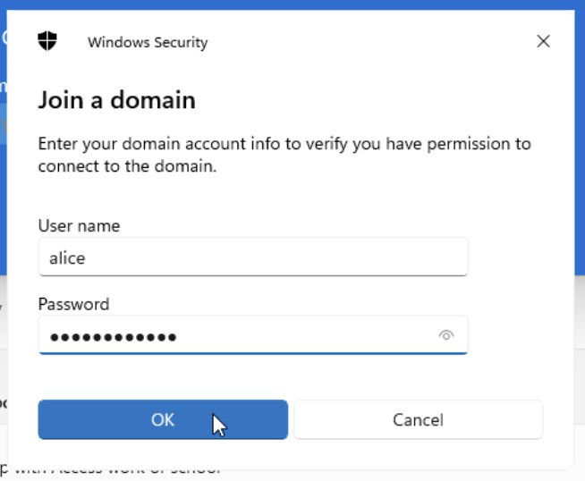

If you get a step to add a user, skip it and choose not to restart the computer. 

One last step before we can connect to RDP via our lab user Bob, is to give the workstation a static IP. Similar to before we need to go over to the WinWS01-Lab network settings to grab the MAC address then paste it into `Services > DHCP Server > Add Static Mapping` and give it the IP address 172.16.0.11.

## Connect via RDP

Now restart the Windows workstation machine and connect to it from the Windows App. You will need to create a new PC using the new static IP address.

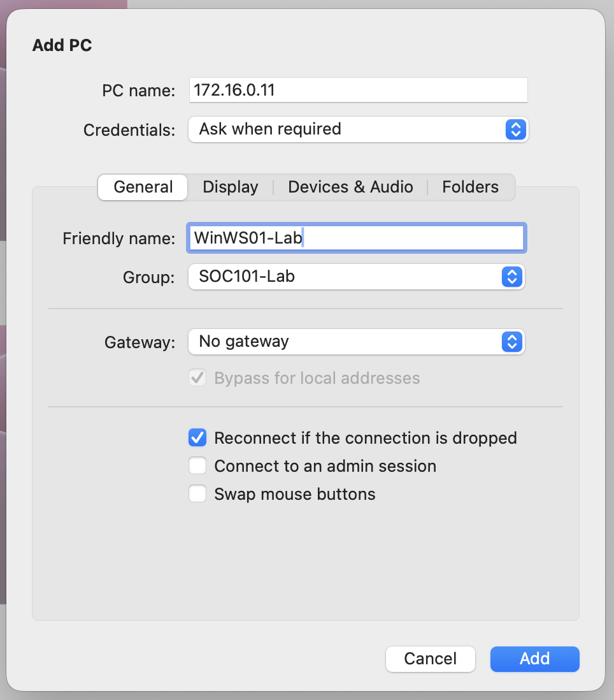

Create a new user with Bob's credentials since this will be his machine.

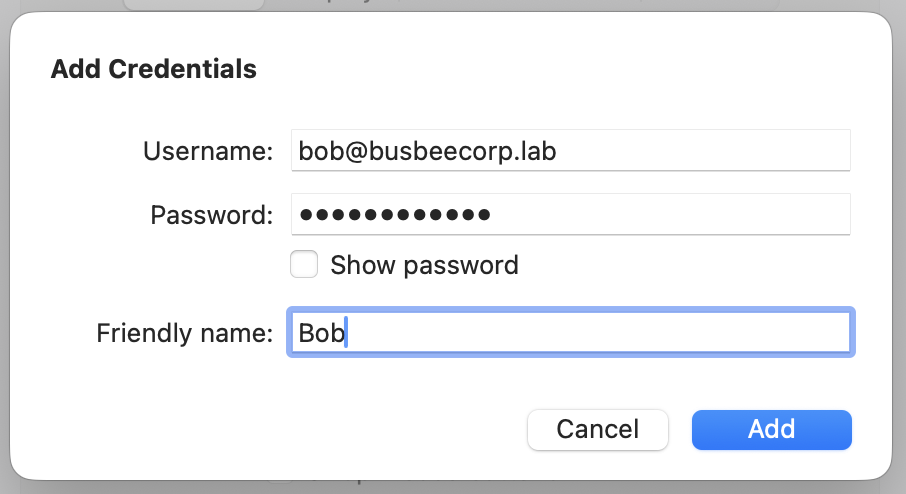

Now you should be able to connect to the WinWS01-Lab machine through RDP with Bob's login. If you have any errors connecting, go back and make sure you set everything correctly.

## Installing Sysmon (again)

We will want Sysmon installed on all Windows devices in our lab for monitoring purposes. Luckily the install instructions are exactly the same for Windows 11 as it is Windows Server. Just make sure to open a Windows PowerShell terminal as administrator then run the same commands as above.

## Atomic Red Team (again)

We also want to install Atomic Red Team on our workstation machine. To do so you can run the exact same commands again but from an Administrator PowerShell.

Once you get to this step you should be basically done setting up the windows environment.Up next we need to build a Security Onion VM to act as a network monitor.

