# Previous: [[2. Windows Environment]]

Security Onion is a Swiss Army Knife of security tools that has several different systems built in such as Zeek, Suricata, osquery and can be used to monitor networks and capture network packets. For this lab we will use it mainly as a network monitor that will forward Zeek logs to Splunk for log analysis. 

# Download ISO

Installing Security Onion is similar to the other VMs so far. First we need to download the ISO to Proxmox, then build out a VM for it in the Wizard. Here's a few commands you can use to download Security Onion from the Proxmox terminal:

```
STORAGEPATH="/var/lib/vz/template/iso"
VERSION="2.4.180-20250916"
ISO="securityonion-${VERSION}.iso"
ISO_URL="https://download.securityonion.net/file/securityonion/${ISO}"

wget -c -L -O "${STORAGEPATH}/${ISO}" "${ISO_URL}"
```

The ISO file is rather large (14GB) so you may want to go take a break while waiting for this to finish. Once its done you can click the Create VM in the top right corner of Proxmox to start the wizard. I used the following config for Security Onion:

- **VM ID**: 904
- **Name**: SecOnion-Lab
- **Disk size**: 250GB
- **CPU Cores**: 4
- **Memory**: 24GB
- **Bridge**: vmbr1

# SPAN port

Before turning on the machine and installing Security Onion we will need to make some changes to the network settings. Security Onion has the ability to listen to the network on a second port on the network called a SPAN port that allows it to hear all traffic flowing through the network, not just those intended for the SO machine or broadcasts to all machines. This means Security Onion can hear two other machines on the network talking to each other, which would be impossible only using the one standard network connection. 

We will need to make some changes within Proxmox to allow for this. First we need to create a second NIC on the Security Onion hardware settings by going to `Datacenter > [Node] > SecOnion-Lab > Hardware > Add > Network Device > OVS Bridge`. Use the following settings:

- **Model**: VirtIO (paravirtualized)
- **Bridge**: vmbr1
- **Firewall**: Unchecked

This sets the SPAN port to listen on vmbr1. Now we just need to get Proxmox to mirror all traffic on vmbr1 to this port. This can be done by going to the Proxmox terminal at `Datacenter > [Node] > Shell` and running this command:

```
ovs-vsctl clear bridge vmbr1 mirrors 

ovs-vsctl -- --id=@p get port tap904i1 -- --id=@m create mirror name=span1 select-all=true output-port=@p -- set bridge vmbr1 mirrors=@m
```

The command above does the following:
- Clears out any previous mirrors on vmbr1
- Creates a new mirror called span1
- Sets it to mirror vmbr1
- Connects the mirror to output to the net1 NIC on VM ID 904.

> For better understanding of this command I found this blog post incredibly helpful: https://vext.info/2018/09/03/cheat-sheet-port-mirroring-ids-data-into-a-proxmox-vm.html


Unfortunately, Proxmox does not save this mirror setting in the event of a power off or reboot. This means we will either need to run this command every time Proxmox restarts or create a script to automate that action. The blog post above provides a solution to this which I will show below as well. 

```
#!/bin/bash

# seconiontap.sh

SECONIONLOG=/root/seconiontap.log

date >> $SECONIONLOG

echo "####################" >> $SECONIONLOG


echo "Clearing any existing mirror..." >> $SECONIONLOG

ovs-vsctl clear bridge vmbr1 mirrors

echo "Creating mirror on vmbr1 for Security Onion..." >> $SECONIONLOG

ovs-vsctl -- --id=@p get port tap904i1 -- --id=@m create mirror name=span1 select-all=true output-port=@p -- set bridge vmbr1 mirrors=@m >> $SECONIONLOG

echo "Showing existing mirrors..." >> $SECONIONLOG

ovs-vsctl list Mirror >> $SECONIONLOG

echo "####################" >> $SECONIONLOG
```

The script sets the mirror but more importantly provides logging functionality so we can look into any issues that may arise over time. I created this script in the `/root/` folder and called it `seconiontap.sh`. 

I then ran `crontab -e` to add this line to the Crontab file:

```
@reboot sleep 120 && /root/seconiontap.sh
```

This will tell Proxmox to run the script 120 seconds after rebooting. You may have to fine tune the number of seconds to make sure the Security Onion VM is up and running first before the script runs.

# Set Static Mapping

Now find the MAC address of the Security Onion VM by going to `Datacenter > [Node] > Hardware > Network Device (net0)` which should be the NIC of the vmbr1 network interface. Now lets go to the pfSense console at https://172.16.0.1 and log in with your admin account. 
Next go to `Services > DHCP Server > Add Static Mappings` and add a new entry for Security Onion. Paste in the MAC address for the Security Onion VM vmbr1 NIC and set it to the IP address 172.16.0.12. Now click Save > Apply Changes to save the mapping.

# Install VM

Now we can turn on the Security Onion VM and walk through setup. After clicking Start go to the console page for the VM where you should be greeted with the initial install page for Security Onion. You can select the first option which will give us a standard Security Onion install. 

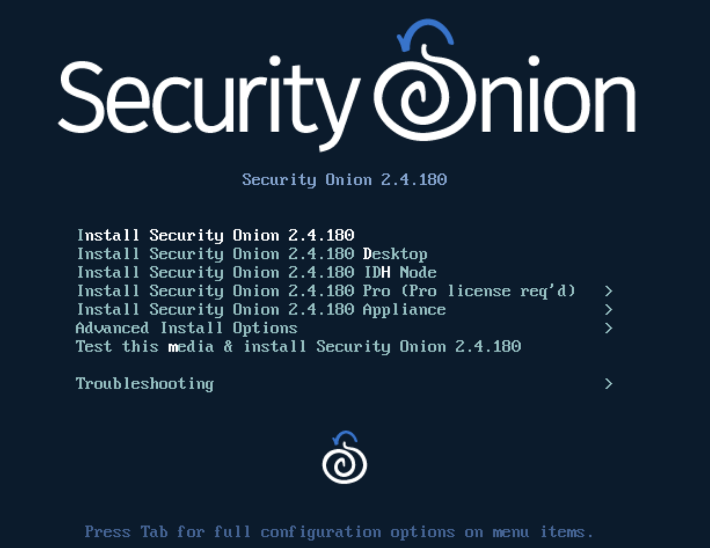

You will then be asked whether it's okay to delete the contents of the VM hard drive to install Security Onion. Since this is a fresh virtual HD we have nothing to worry about.

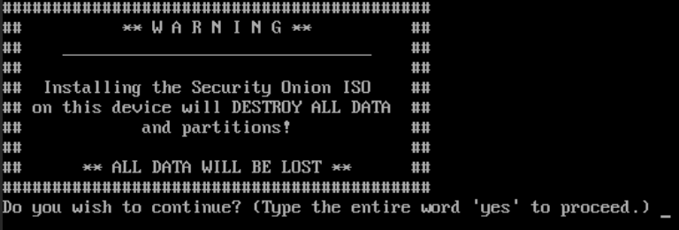

Type `yes` to continue. You will then be asked to create an administrative user for this install. I chose the name `admin` and gave it a strong password. Next it will kick off the installer. You will need to let this run for a while. Eventually you will see a screen asking you to press Enter to Reboot. Do that and wait for it to turn back on. 

After the reboot finishes Security Onion will ask you to login with the account created during setup. Give it those credentials then click Yes on the screen asking you to continue.

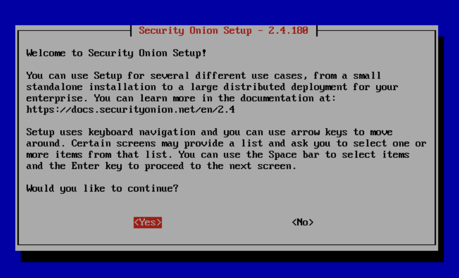

Next choose Install from the menu. 

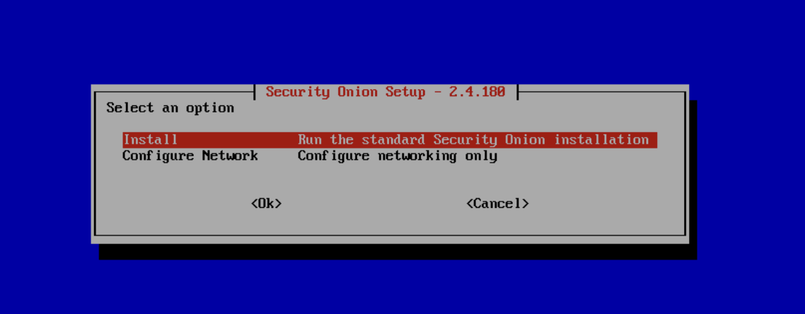

On the next screen choose Standalone.

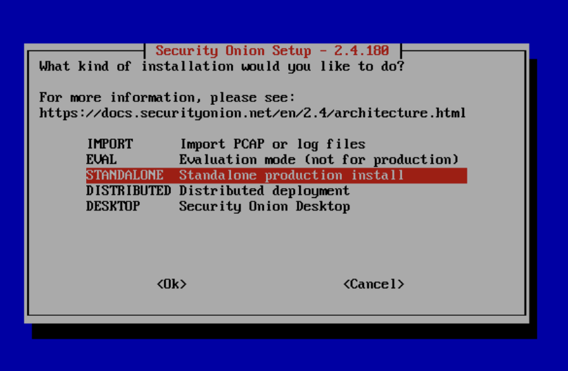

Type AGREE to accept the license terms then select Standard as the network type.

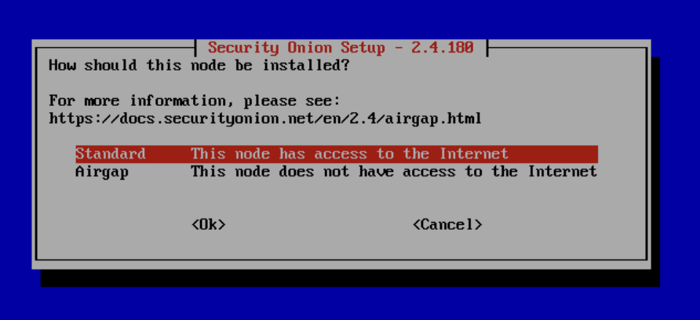

Give it the hostname seconion-lab to match the Proxmox naming.

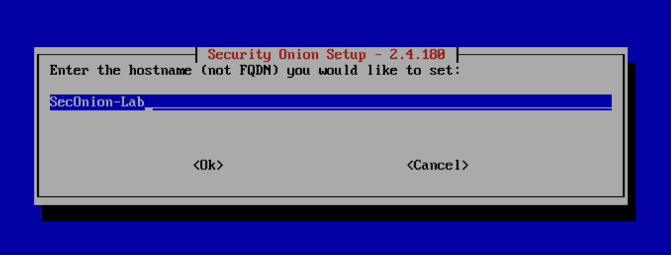

> Note: Uppercase characters can cause conflicts in some instances so its best to make sure your hostname uses all lowercase.

Next you will be asked to select the NIC to be used for management. This is referring to the standard network connection that will be provided by the vmbr1 interface. Make sure to select the correct MAC address that corresponds to this NIC. 

> Note: You may have to look at the hardware settings for the Security Onion VM to tell these apart.

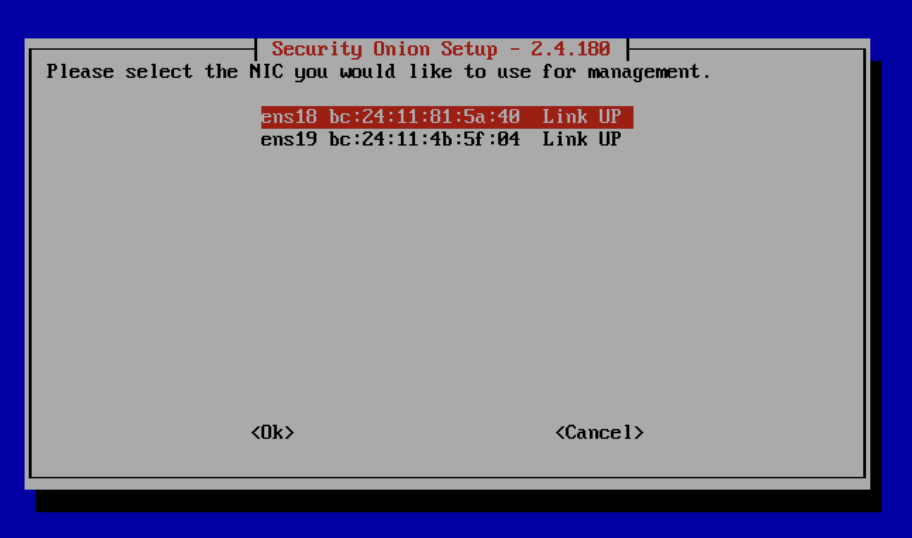

Next it will ask whether to use a Static IP or DHCP. I will set it to DHCP here so that our pfSense static mapping can take over. On the next page you will be warned that a DHCP address can cause problems but don't worry about that if you have the static mapping in pfSense set up.

On the next two pages you will be asked whether to connect to the internet directly or via proxy and whether to use the default docker IP range. Choose direct and yes respectively.

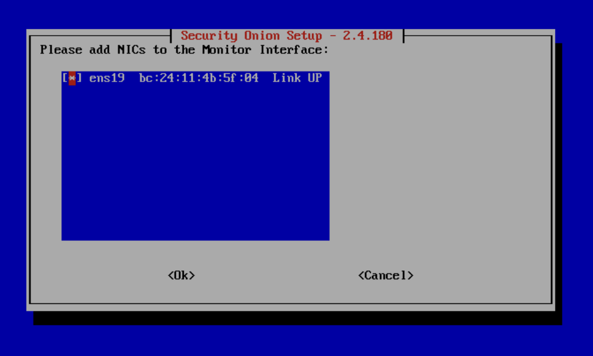

On the next page you will be asked to select the Monitor Interface. We want to make sure the MAC address of the vmbr2 SPAN port we created is selected. You can tap the Spacebar with the selection highlighted to add an asterisk to the selection. Then click Ok to move on to the next page.

The next page will ask to enter an email address for an admin user. Provide this and create a strong password to go with it.

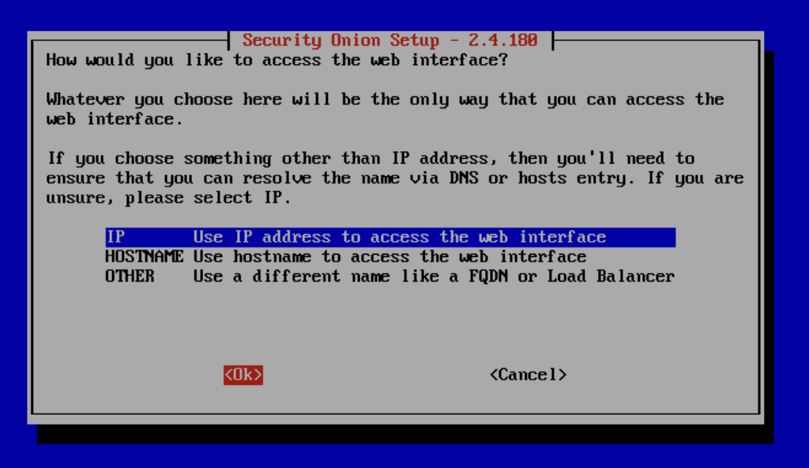

The next page will ask which method you would like to use to access the Security Onion web interface. Select IP here for simplicity. If we decide to implement DNS later we can come back to this. On the next page choose Yes to allow access to the web interface.

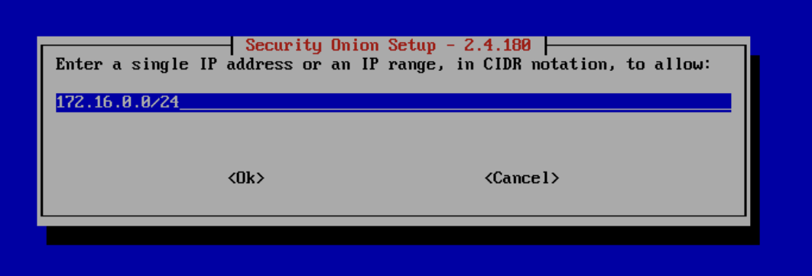

You will then be asked to provide an IP or network range that is allowed to view the web interface. Here enter 172.16.0.0/24 so it is visible from our network. Later we may want to consider restricting this down somewhat.

On the last page you will be given a list of your chosen configuration settings. Click Yes to approve these settings and let Security Onion go off and begin installing its necessary items.

When the install finishes you should be spit back out into the terminal console. You can type `sudo so-status` to see the current status of the Security Onion services.

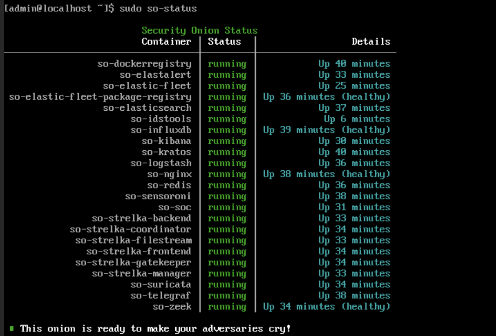

You should also be able to visit https://172.16.0.12 in your browser to see the Security Onion web console. You will need to login using the email address and password supplied during setup. 

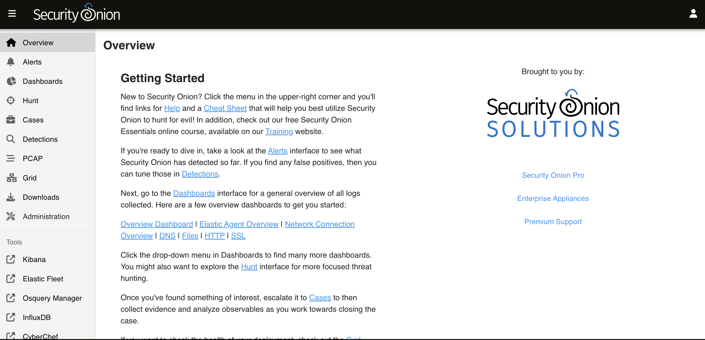

Once logged in you should see the dashboard with several views and tools on the left sidebar. Now there are just a few bits of housekeeping left to do to get us up and running.

# Post-Install Config

Go back to your Security Onion terminal in Proxmox and run the following commands to switch to the root user and update the SO packages.

```
sudo su -
soup
```

> Note: You will either need to reboot because updates were found or switch back to your user account if reboot is unnecessary by using `su <username>` 

Next we need to run a series of commands to enable promiscuous mode on the the SPAN interface in a way that is persistent. First we need to create a new service by first switching to root `sudo su -` and then running the following command:

```
echo "[Unit]
Description=Enable promisc on SPAN iface
After=network.target

[Service]
Type=oneshot
ExecStart=/sbin/ip link set ens19 promisc on
RemainAfterExit=true

[Install]
WantedBy=multi-user.target" > /etc/systemd/system/promisc.service
```

Next run these commands to enable the service and reboot Security Onion.

```
systemctl daemon-reload && systemctl enable promisc.service
reboot
```

After it reboots check that `ens19` is running in promiscuous mode by running:

```
ip link show ens19
```

You should see something that looks like this:

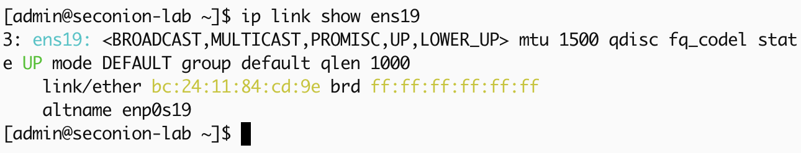

If you see this it should mean everything was installed correctly. 

# Testing Mirrored Traffic

There are two ways you can check whether Proxmox is correctly mirroring traffic to the SPAN port, by running tcpdump and viewing the Kibana dashboard on Security Onion's web portal.

For tcpdump, go to a Proxmox shell and run:

```
tcpdump -i tap904i1 -n 
```

You should see a lot of packets begin to flow in from various source and destination IP addresses.

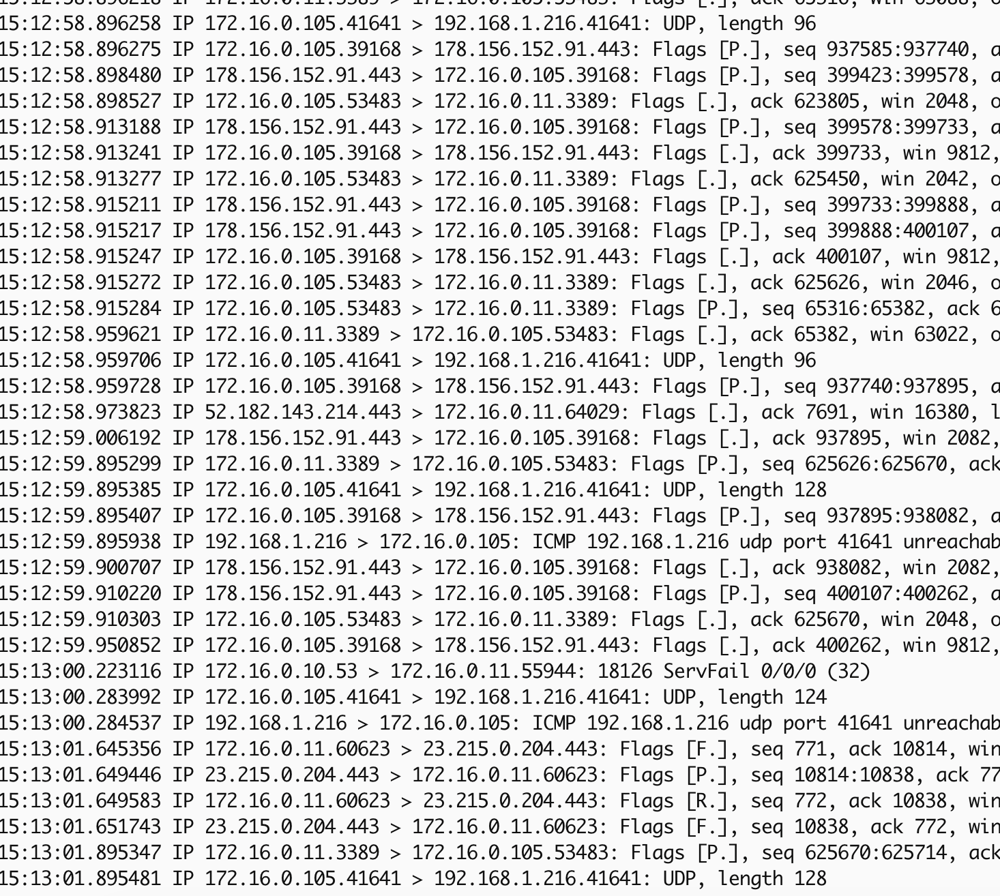

You can also go to your Security Onion web portal at https://172.16.0.12 and choose Kibana on the left side to get to the Kibana data visualization page.

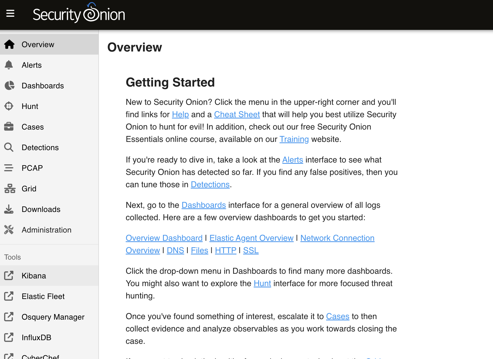

The Kibana dashboard will show you a lot of information about what it sees. To drill deeper into the network data you can click Network in the Event Category section.

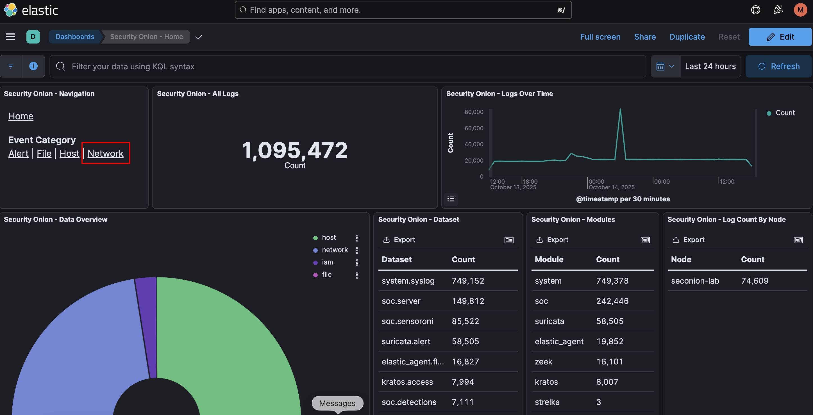

Here you can see a breakdown of network traffic by a few different dimensions. 

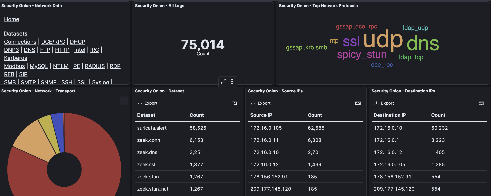

Seeing all of this tells me that our Security Onion install is a success and we can move on to setting up Splunk for log management and visibility.

# Next: [[4. Splunk]]
