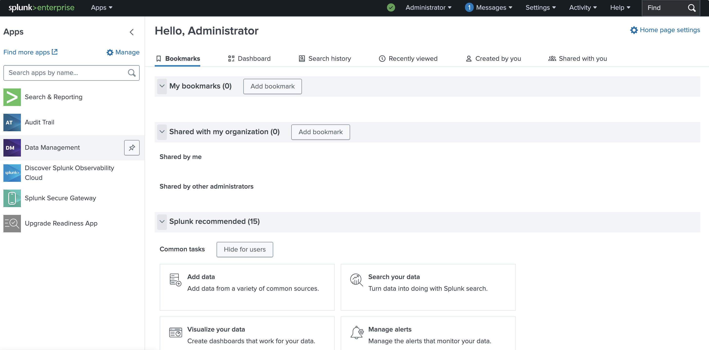

# Previous: [[3. Security Onion]]

Splunk is a powerful tool that can be used to collect, analyze, and visualize log data from virtually all devices on a network. It helps organizations monitor and investigate security issues that arise and help track events as they affect multiple devices. 

Splunk has options to deploy in the cloud or on premises. For our lab I am going to install it on-prem as another VM in Proxmox. From there we will just need to install the Splunk Universal Forwarder on all devices so that all events across the lab network can be viewed together in one place.

# (Optional) Developer License

Splunk has a very limited free plan that lets users ingest up to 500MB of log data per day as well as limits that lock you down to one single Splunk instance. This should be plenty for our lab, but if you can also sign up for a Splunk Developer License to get your ingest limit increased to 10GB per day. This will give a bit more overhead so you can get a bit more done in your labs if you want. 

Go to https://dev.splunk.com/enterprise/dev_license/ for instructions on how to sign up. You will need to create a Splunk account on the [Splunk Developer page](https://dev.splunk.com/developer-program/). The sign up page will ask you several questions about what you plan to do with the platform. I just said I was a student and hobbyist developer and that I just want to play around with the tools. 

# Download & Install VM

First we need to download and install Ubuntu Server as a base for Splunk to sit on. To download the Ubuntu Server 24.04 ISO to Proxmox run the following in a Proxmox shell:

```
STORAGEPATH="/var/lib/vz/template/iso"
VERSION="24.04.3"
ISO="ubuntu-${VERSION}-live-server-amd64.iso"
ISO_URL="https://releases.ubuntu.com/noble/${ISO}"
wget ${ISO_URL} -O ${STORAGEPATH}/${ISO}
```

Now Click Create VM in the top right to create a new Ubuntu Server VM with the following settings:

- **VM ID**: 905
- **Name**: Splunk-Lab
- **Start at boot**: Checked
- **Bus/Device**: VirtIO Block
- **Disk size**: 200 GB
- **CPU Cores**: 8
- **CPU Type**: host
- **Memory**: 16384
- **Bridge**: vmbr1

Before powering on the VM go into pfSense and give it a static IP mapping. I will chose 172.16.0.13 for Splunk. Remember this can be found by going to pfSense console at https://172.16.0.1 and selecting `Services > DHCP Server > Add Static Mapping` and connect the IP to the MAC address of the Splunk VM. When this is done click Save > Apply Changes to save the mapping.

Now just power it on and run through the Ubuntu Server setup. Here's a list of the settings I selected for the install:

- **Type of Installation**: Ubuntu Server
- **Search for Third Party Drivers**: Checked
- **Use Entire Disk**: Checked
- **Your name**: splunk
- **Server name**: splunk
- **Pick a username**: splunk
- **Install OpenSSH Server**: Checked

After finishing the install wizard it will ask you to confirm the settings and reboot the machine. Wait for everything to finish, then reboot.

# Installing Splunk

Once the Splunk VM comes back online you will be asked to login with the user created during setup. After logging in you will need to run a few commands to get the VM updated and make sure the qemu guest agent is installed.

```
sudo apt update && sudo apt upgrade -y
sudo apt install qemu-guest-agent -y && sudo systemctl enable qemu-guest-agent
sudo reboot
```

Wait for the VM to reboot then run the following commands to download, install, and start Splunk.

```
wget -O splunk.deb 'https://download.splunk.com/products/splunk/releases/10.0.1/linux/splunk-10.0.1-c486717c322b-linux-amd64.deb'
sudo dpkg -i splunk.deb
sudo /opt/splunk/bin/splunk start --accept-license
sudo /opt/splunk/bin/splunk enable boot-start
```

During setup you will be asked to create a new Splunk user. I chose the username `admin` and a strong password. 

Once the install is complete Splunk can be accessed by going to its URL at https://172.16.0.13:8000. You will need to then login using the username and password chosen during the Splunk install setup. You should then be taken the the default homepage for Splunk.



I also added the following lines to allow Splunk through the UFW firewall:

```
sudo ufw allow 8000/tcp
sudo ufw allow 8089/tcp
sudo ufw enable
```

With this done we now just need to install the Splunk Universal Forwarder on all of our lab devices:

- pfSense
- Tailscale
- Windows Server
- Windows Workstation
- Security Onion

Once they are in place they will push log data from each device up into Splunk for us to analyze in the lab. Without this step there would still be no data to look at.

# Creating Network Index

`Splunk > Settings > Indexes > New Index`

- **Name**: network

Click Save

