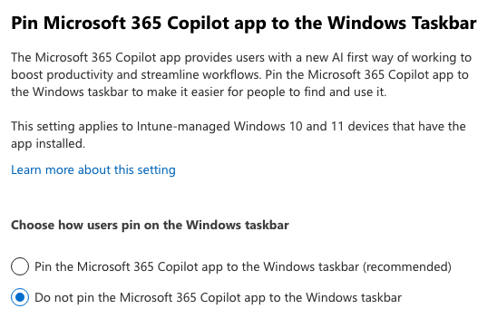
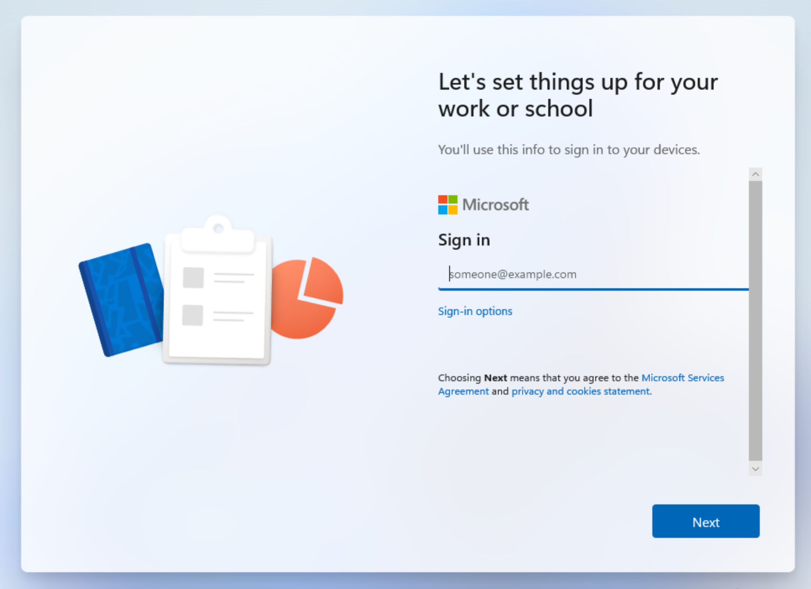
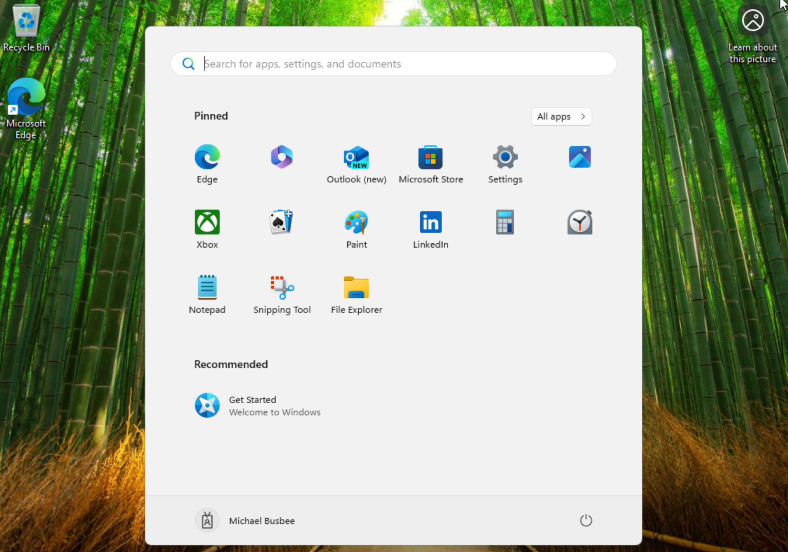

# Removing Windows Hello

When I ran my first OOBE test my user was prompted with the requirement to setup Windows Hello. I want to turn this off entirely so I found going to `Intune > Devices > Enrollment > Windows Hello for Business` and set Configure Windows Hello for Business to Disabled and clicked Save.

# Removing 365 Copilot Pin Prompt

Another thing I noticed on the last OOBE test was a prompt asking the user to pin Microsoft 365 Copilot to their taskbar. I do not want users to have to worry about this so I looked into how to disable it in the portal. 

Turns out you can go to `Microsoft 365 > Copilot > Settings > User Access` and set Pin Microsoft 365 Copilot App to the Windows Taskbar setting to Do Not Pin and click save.

While I was in here I also went through and disabled Copilot across most of the tenant settings. 

# Testing Setup

Now comes the time to reboot/startup the VM and see if the changes too effect. I started it up and instead of the initial questions where setup asks me to choose a region and language, it instead immediately asked me to sign in with a Microsoft account. Here this should let my user log in with their corporate account that was made for them.

After logging in I got a screen that says "Please wait while we set up your device..."

Once set up completed it logged me into my account and showed me the desktop. I was not prompted with any Windows Hello or 365 Copilot questions.

I checked settings and it shows I'm logged in with my corporate account and the name scheme took effect labeling the device as `[Serial Number]-W`. It looks like the initial run was successful. Next I want to test installing apps on the device.

