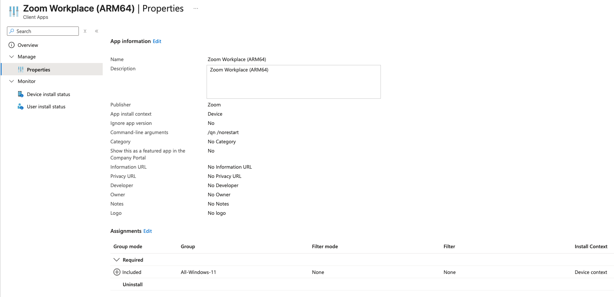

## Installation Methods

I wanted to test a few commonly used apps that also showcase the different methods of installing apps with Intune. I decided on the following:

- Line-of-business (LOB) - Zoom Workplace
- Win32 App - Google Chrome
- Microsoft Store app - GlobalProtect VPN
- Microsoft 365 Apps for Windows 11

I will also need to make sure my [[2. Enrolling Devices#Creating an Enrollment Status Page (ESP)|Enrollment Status Page]] settings block the user from accessing the device until the installations are complete.

## Line-of-business (LOB) - Zoom Workplace

To create a LOB app you basically just need to find the .msi version of the app's installer and load it into Intune. Just go to `Intune > Apps > All apps > Create > App type > Line-of-business app`.


Next it will ask to upload the file you can select it from your computer locally after downloading it from the internet or wherever else.


In my case I went to [Zoom's Downloads for IT Admins](https://zoom.us/download/admin), selected the Download (ARM64), and downloaded it to my computer. I then went back to Intune and selected this file for the upload.


> Keep in mind I only chose ARM due to the VM used for testing. In another environment you would want to consider the architecture and OS requirements for your app/device compatibility.

Luckily for me the Intune LOB App Wizard pre-populated a lot of the information to set up the app including the Name and Description. It labeled it as (ARM64) so if I needed to also provision the AMD64 version it would be easy to tell them apart.

For the Command-line arguments section I added the following:

```
/qn /norestart
```

This will prevent the device from restarting after the Zoom install is complete. 

I also needed to set the App install context to `Device` so that it automatically installs it during OOBE setup. If you keep it as the default `User` it will only install it after the user logs in, and it is only available for that user on the machine. I found it made more sense to keep it device-wide.

On the Assignments page I chose the `All-Windows-11` group to receive this install. This is where I could consider separating app availability by group membership but for now I will allow it on all Windows 11 devices.



## Win32 App - Google Chrome

If the app developer does not provide an MSI version of the installer and you are forced to use an EXE or some form of script, you can wrap it in a Win32 App to make it usable within Intune. This can be done by using Microsoft's [Content-Prep-Tool](https://github.com/Microsoft/Microsoft-Win32-Content-Prep-Tool) which is a Windows only tool for creating Win32 Apps. 

Since I had to use Windows, I downloaded the tool on my Windows machine, calling the file "Win32Prep" and created the following file structure:

```
C:/
├─ Source/
│  ├─ Chrome/
│  │  ├─ ChromeSetup.exe
├─ Tools/
│  ├─ Win32Prep/
│  │  ├─ IntuneWinAppUtil.exe
├─ Output/
```

I then used the following command in a Windows machine to turn the Google Chrome:

```
C:\Tools\Win32Prep\IntuneWinAppUtil.exe `
  -c "C:\Source\Chrome" `
  -s "ChromeSetup.exe" `
  -o "C:\Output"
```

Once this process completes you should see a `ChromeSetup.intunewin` file in the Win32Oput folder. Next is uploading this to Intune and creating an App for it.

Back in Intune I went to `Intune > Apps > All Apps > Create > App Type > Windows app (Win32)` and when it asked for the file I gave it the .intunewin I just made. I gave it the name Google Chrome (ARM64) to be consistent with the Zoom App.

I then entered the following settings:

- **Install command**: `ChromeSetup.exe /silent /install`
- **Uninstall command**: `"%ProgramFiles%\Google\Chrome\Application\chrome.exe" --uninstall --system-level --force-uninstall`
- **Allow available uninstall**: No
- **Install Behavior**: System
- **Device restart behavior**: No specific action

This will make sure Chrome installs for all users, the users are not allowed to uninstall the app, and the app will not restart the device after installation.

On the Requirements page I selected the following:

- **Check operating system architecture**: Yes - Install on ARM64 system
- **Minimum operating system**: Windows 11 21H2

This ensures this app can only install on ARM64 devices with any version of Windows 11. Since this is a fairly small app install I did not make any hardware requirements. 

Detection Rule settings:

- **Rule type**: File
- **Path**: C:\Program Files\Google\Chrome\
- **File or folder**: chrome.exe
- **Detection Method**: File or folder exists

For Assignments I selected this app be required for the All-Windows-11 group to be available for all Windows-11 users.

With all of that in place I hit Create and let Intune build the app for me and everything seemed good to go.

## Microsoft Store app - GlobalProtect VPN

To create a Microsoft Store app you just need to go to `Intune > Apps > All Apps > Create > App type > Microsoft Store app (new)` and searched for "GlobalProtect" in the search bar.


When I selected this it auto-populated most of the information for me in the App Information settings. I did however change the Install behavior to `system` to ensure this would apply to all users on the device.

On the next page I assigned this to be required for the All-Windows-11 group then hit Create to let Intune build this for me. 
## Microsoft 365 Apps for Windows 11

Microsoft Office 365 Apps are another install that will often be requested in corporate enterprise environments. Microsoft makes it easy to install this by offering the Office 365 installer as a built in option in the Intune Apps Create menu. Just go to `Intune > Apps > All Apps > Create > App Type > Microsoft 365 Apps > Windows 10 and later` to start the creation wizard.

For the App Setup Information I kept the defaults, feel free to tweak as needed. On the Configure App Suite page I made the following changes:
- **Select Office Apps**:
	- Excel
	- Outlook
	- PowerPoint
	- Teams
	- Word
- **Architecture**: 64-bit
- **Default file format**: Office Open XML Format
- **Update Channel**: Monthly Enterprise
- **Remove Other Versions**: Yes
- **Use shared computer activation**: Yes

On the assignments page I set the install to run for all devices in the All-Windows-11 group and clicked Create so Intune could start building the app.

## Testing

After all the apps were set up in the portal I restarted my VM OOBE snapshot to start fresh. I let it run for a few minutes and saw the Enrollment Status Page say Installed Apps: 4 out of 4. I was then taken to the device desktop where I confirmed all apps installed.


You can also confirm the apps were installed from the Intune portal by going to  `Intune > Devices > Windows > [Device Name] > Managed Apps`.


## Bonus: VMware Tools (Win32 App)

I decided it would be easier on me if I could have my test devices automatically install VMware Tools. Since the installer only comes in the form of an EXE I had to do it as a Win32 App. 

First I needed to get the EXE file and create the wrapper file. I found the file `setup.exe` by finding the ARM version of the `windows.iso` and mounting it to my system and looking inside. The method of doing this will be different depending on your version of VMware and the OS of your hypervisor host. 

Once you have the EXE you can perform a similar step as above with Chrome:

```
C:\Tools\Win32Prep\IntuneWinAppUtil.exe `
  -c "C:\Source\VMwareTools" `
  -s "setup.exe" `
  -o "C:\Output"
```

This created a file called `setup.intunewin` which I could then upload to Intune.

Before I did that I needed to create a new dynamic group that only applies to VMware VMs. I created one in Entra using the following dynamic rule and called it `All-VMware`

```
(device.deviceModel -contains "VMware") 
     or (device.deviceManufacturer -contains "VMware")
```

For the Win32 App I used the following settings:

- **Name**: VMwareTools (ARM64)
- **Description**: VMwareTools (ARM64)
- **Publisher**: VMware
- **Install Command**: setup.exe /S /v "/qn REBOOT=R ADDLOCAL=ALL"
- **Uninstall Command**: setup.exe /S /v "/qn REMOVE=ALL REBOOT=R"
- **Allow available uninstall**: No
- **Install Behavior**: System
- **Device restart behavior**: App install may force a device restart
- **Minimum Operation System**: Windows 11 21H2
- **Detection Rule**:
	- **Rule Type**: File
	- **Path**: C:\Program Files\VMware\VMware Tools\
	- **File or folder**: vmtoolsd.exe
	- **Detection method**: File or folder exists
	- **Associated with a 32-bit app on 64-bit clients**: Yes
- **Assignment**: All-VMware
