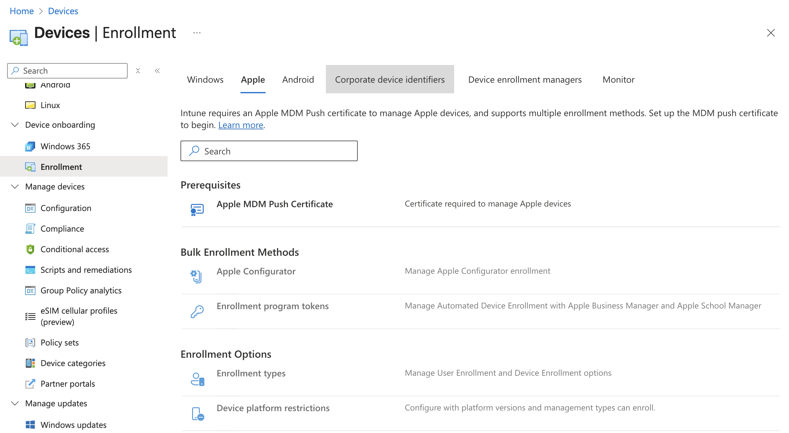
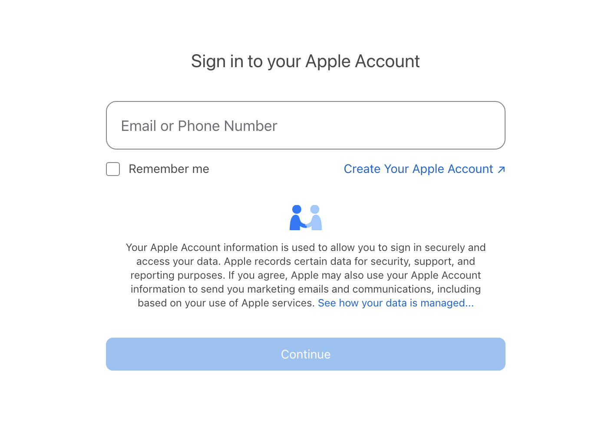
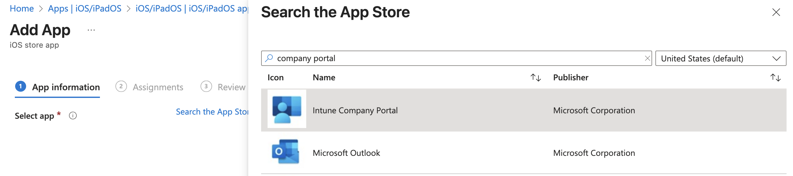
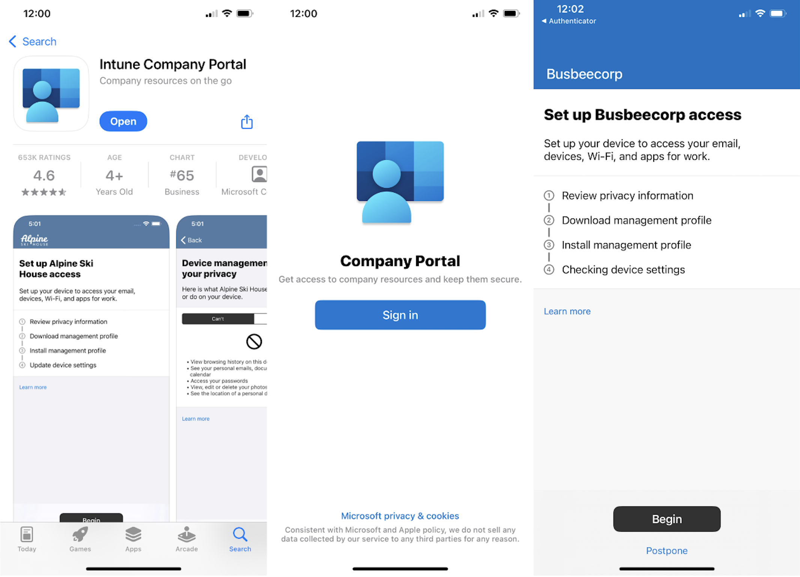
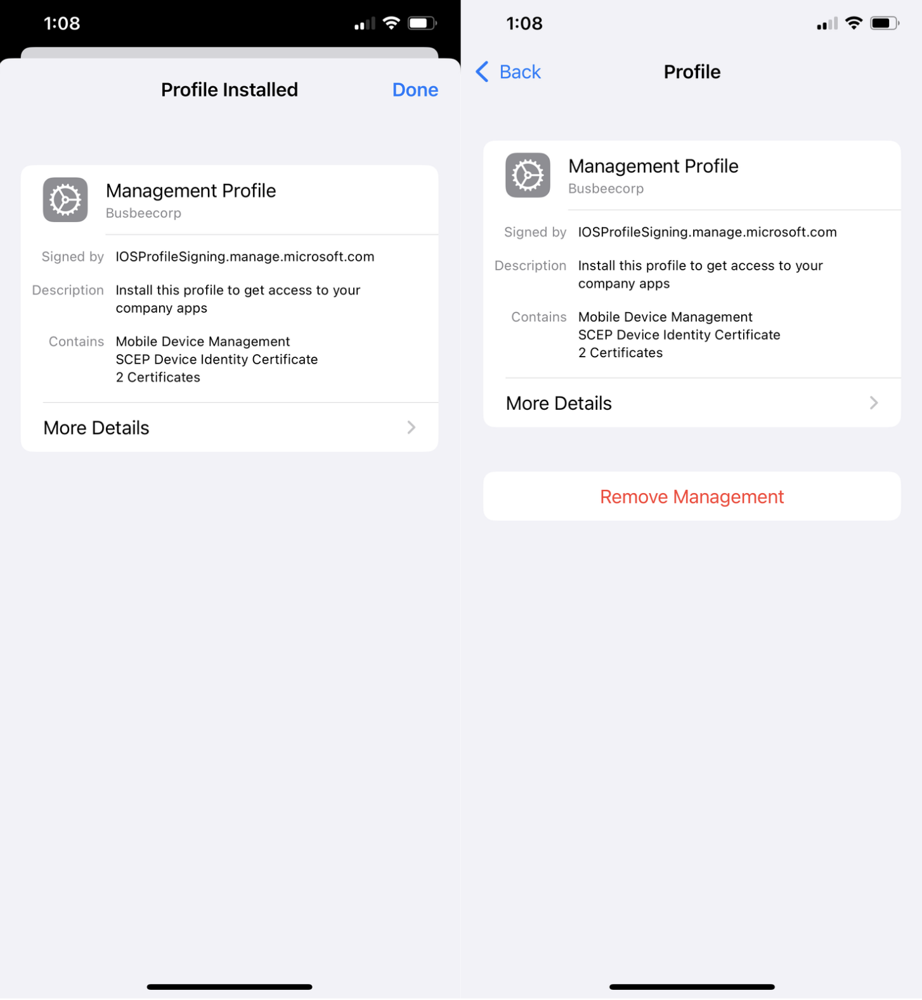

## Benefits of Managed iPhones

Intune allows you to enroll and manage other devices beyond just Windows 11. With some additional setup, you can connect Apple iPhone and Google Android devices. In this section I will show how to install an Apple Push Certificate so their servers are able to connect with Intune. 

When iPhones get enrolled through the Intune Company Portal, IT teams gain visibility into the device setting such as hardware, OS version, jailbreak status, and compliance status. Intune also can control settings on the device like passcode, Wi-Fi, certificate requirements as well as OS update deferral capability. Intune also has the ability to protect apps on the device with a MAM policy to prevent actions such as copy/paste from a managed app to an unmanaged one. Intune can also take action in the event the device is lost or stolen: full/selective wipe, lost-mode, lock-screen PIN reset, etc.

## Apple MDM Push Certificate

An Apple MDM Push Certificate is required to create a handshake between Intune and Apple's Push Notification (APN) service. It its what builds the trust relationship between the individual device and the Intune server. Every MDM command we order through Intune must pass through APN to reach the devices.

To sign up for a new Push Certificate you will need to have an apple account. If you want to create a new account you can do so at [appleid.apple.com](https://appleid.apple.com)

First you will need to go to Intune and download the Certificate Signing Request (CSR). This contains Intune's public key that will need to be signed by Apple. It can be found by going to `Intune > Devices > Enrollment > Apple > Apple MDM Push Certificate`. 

In the Apple MDM Push Certificate section you will need to first check the box granting Microsoft permission to send info back and forth with Apple. Next you will need to download the IntuneCSR.csr file by clicking "Download your CSR". Once downloaded, click the link for "Create your MDM push Certificate" which will take you to Apple's page asking you to log in with your Apple ID.

Here you will need to log in with the Apple ID you intend to use with Intune. 

Logging in will take you to Apple Push Certificate Portal. You will just need to click the Create a Certificate button to get started. 

Agree to the Terms and Conditions, then upload the CSR file we downloaded from Intune. You can leave a note for the certificate such as "Intune Lab Connector".

Once you click Upload you will be taken to the next page where your Push Certificate gets generated and you can download a copy.

Clicking download will provide a file called `MDM_ Microsoft Corporation_Certificate.pem` that we can take back to Intune. Clicking Manage Certificates takes you to a page where you can see all 3rd Party server certificates issued by this Apple account. You have the ability to revoke, renew, or download the certificate we just made.

> It's worth noting that the APN Certificate we created has an expiration set for 1 year from its issue date. This should be plenty of time for our lab setup but depending on your use-case you may want to consider renewing or replacing the certificate after one year.

Now that we have the .pem file we can upload it back into Intune which will complete our trust connection between the two environments. Back on the Configure MDM Push Certificate blade where we were setting things up enter the Apple ID we used to create the certificate on step 4 and upload the .pem file on step 5.

Once finished you should immediately see a successful connection on the Apple MDM Push Certificate Page.

## Company Portal App

The Company Portal app is one way to enroll devices on iPhone into the Intune. Users will need to download an app called Intune Company Portal from the Apple App Store and sign in using their organization login. Since this enrollment method requires user's devices to already be setup to access the App Store, Company Portal is better as an option for BYOD devices or those that require fewer restrictions.

> Another enrollment method would be to use Automated Device Enrollment to create an Out-of-the-box experience that automatically sets up the iPhone during first power on. Unfortunately, this method requires access to Apple Business Manager which can only be obtained by having a business account with Apple. This will be out of reach for many aspiring lab builders so I will leave it out of the scope of this guide.

To setup the Company Portal go to `Intune > Apps > iOS/iPadOS apps > Create > iOS Store app`. In the create wizard you will need to select "Search the App Store" in the first step when selecting the app and search "Intune Company Portal". 

For App Information I will keep the defaults the app provides. On the Assignments page I will apply this app to members of the All-Employees group under the "Available for enrolled devices" section.

## Testing Enrollment

It seems the only way to test an iPhone enrollment is to grab a device and download the Company Portal app. I tried running an iPhone simulator through Xcode but it does not allow app installs from the app store. Instead, enjoy these photos from my phone:

First go to the App Store and search for and download the Intune Company Portal app. When you open the app it will ask you to sign in. Use the organization account of one of the users in Entra. Once signed in you will see a series of steps to complete to enroll your device.

The first page will outline what information Intune can and can't see on your personal device. This will be important to users of the organization who may worry about what data they are sharing to the organization from their personal devices.

The next page will ask you to allow download the configuration profile required by Intune to be on the device. If your device is configured like mine is, this is the part that will trigger a 1 hour security delay on your iPhone that will require you to wait until resuming the setup process.

Once the profile is downloaded you can go to `Settings app > General > VPN & Device Management` and click Management Profile from the Downloaded Profile section. On the next page click Install in the top right corner, read the warning, then Install again in the top right corner.

Once the profile is installed you will see a success screen and back on the VPN & Device Management screen you will see this profile as an entry with the option to remove it from the device.

The Intune Company Portal now allows users to download apps from the company to their phone as well as view devices they are connected to. Apps provided here by the company can be configured to have increased protection through Intune MAM policies.
