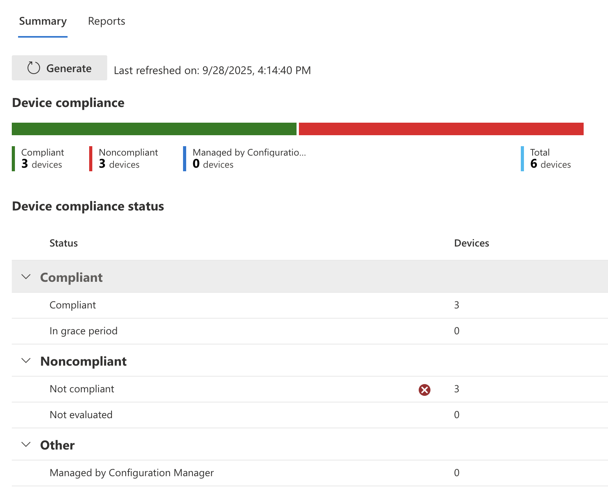
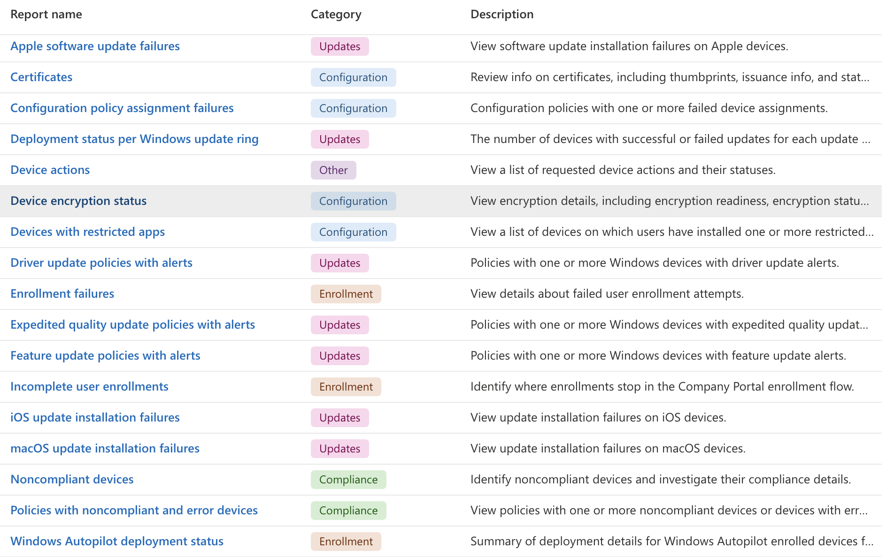

## What can I monitor?

Intune provides several ways to monitor devices it manages. You can make configuration and compliance reports, you can view deployment history or endpoint antivirus reports, or even drill down into a specific device for more information. When in doubt, poke around and take a look at anything that says monitoring and reporting.

## Compliance Reports

Go to `Intune > Reports > Device compliance` to view a summary of device compliance information. If nothing shows here you may need to click the "Generate" button to refresh the data on the page.

Here you will be able to see a breakdown of devices that are compliant vs not. You can also go deeper and get Intune to generate more specific reports such as a Noncompliant devices and settings report.

The full list of built-in reports related to compliance can be found in the reports tab `Intune > Reports > Device compliance > Reports`

Options include: 

- Device Compliance
- Device Compliance trends
- Noncompliant devices and settings
- Devices without compliance policy
- Settings compliance
- Policy compliance
- Windows hardware attestation report

## Configuration Reports

On the `Intune > Reports > Device configuration` screen you can see a summary of configuration policies and their success/failure device totals.

## Microsoft Defender Antivirus

On the `Intune > Reports > Microsoft Defender Antivirus` to see a summary of Antivirus scans on devices managed by Intune. It will give a breakdown of number of devices by status such as clean, pending, critical etc.

In the Reports section of this page you can also get a report of detected malware on endpoints.

## Device and App Monitoring

Both `Intune > Devices` and `Intune > Apps` have their own page called Monitoring that has a list of reports specific to their category that can be generated to give teams more insight.

Screenshot of available Device reports:

Screenshot of available App reports:

