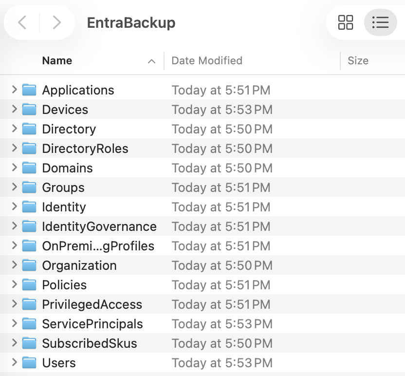

## Now What?

I have reached the end of things I intended to experiment with in my lab for now, although there are many more stones to turn over that we didn't even get a chance to play with. It sometimes requires a living breathing environment to get a sense of how some of the tools and features work within Intune. I am not too heartbroken I wasn't able to test everything, but I am excited to get the chance to work on an even more complex Microsoft 365 environment. 

For the time being, there are a few last minute bits of tidying up to accomplish before I can close out the lab entirely. 

## Collecting Lab Artifacts

First I want to collect as many bits of my lab as possible to save to the GitHub repository, like users, groups, and policies that can all be exported from the Intune portal. In the event I create a new lab down the road these pieces may save me time getting back up to where I was before.

```
Install-Module Microsoft.Graph -Scope CurrentUser -Force
Connect-MgGraph -Scopes "Group.ReadWrite.All" -TenantID "<TenantID>"
Install-Module IntuneBackupAndRestore -Scope CurrentUser -Force
Import-Module IntuneBackupAndRestore
Connect-MgGraph -Scopes `
  "DeviceManagementConfiguration.Read.All", `
  "Device.Read.All", `
  "DeviceManagementApps.Read.All", `
  "DeviceManagementManagedDevices.PrivilegedOperations.All" 
cd ~/Desktop
Start-IntuneBackup -Path ./IntuneBackup

```

Running the PowerShell commands above prompted me to sign in with my Microsoft account, then connected me to Intune and downloaded my Intune configurations into a folder on my Desktop called IntuneBackup.


Inside the folder there were several subfolders that contain apps for devices, policies, profiles, scripts and settings. This folder should be all we need to import into a new Intune environment to get us back to where we were before. Now I just need to do another one of these for Entra. 

```
Install-Module EntraExporter -Scope CurrentUser -Force
Import-Module EntraExporter
Connect-EntraExporter
Export-Entra -Path ~\Desktop\EntraBackup -All
```

The above PowerShell commands will create a folder on the Desktop called EntraBackup. Sign into Microsoft when the pop-up requires it.



The image above shows all the items that Entra exported for us. 

I considered whether to put all of this data in GitHub. Considering all of my environment data is synthesized except for my own personal user in the tenant I just deleted that user out and decided it was safe enough. 

In the real world having your users personal info in JSON files publicly hosted on the internet would be a bad idea. It is also a bad idea to share to the world all of your compliance and conditional access policies because a threat actor could use it to build a plan to get around your security.

## Ending The Free Trial

One last thing I wanted to do with my project is end the free trial to make sure I don't get charged unexpectedly when the 30 day period ends. You can go to `Microsoft 365 Admin > Billing > Your products` and see a full list of every product connected to the account. You can go through them all and hit Cancel Subscription.


I found that the default setting was for recurring billing to be turned off and to expire the trial at the end of the period which was kind of them. If you wanted to take it a step further you could also delete the tenant and Microsoft account for the trial. For now I'll leave that up in case I realize I need anything. With this now done I can consider this lab complete.

## End of the Road

Now that I have finished I think its a good idea to reflect on what we learned in this lab. We got to see how to upload a user database into Entra and assign them to dynamic groups based on their departments. We got to see how to assign licenses to users both by PowerShell scripts and through the portal. We got to learn how to get the hardware hashes of devices and upload them to Intune, as well as creating deployment and enrollment configurations to manage the out-of-the-box experience for users. We learned how to install apps, configure update rings, push security settings to devices as well as enrolling smartphones Lastly we learned how to secure and monitor our environment to ensure smooth operation. There are countless things in the Microsoft 365/Azure environment to learn but I think we did well getting this far. 