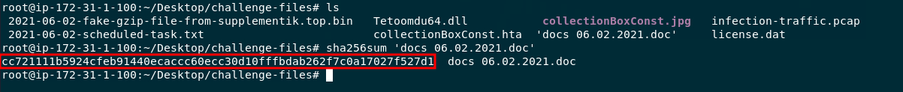

Challenge Link: https://app.letsdefend.io/challenge/IcedID-Malware-Family
Zip File Password: `infected` 
## Question 1
What is the sha256 hash for the malspam attachment?

First I unzipped the challenge files and took a look at what I was given to start.


The first question asks about a malspam attachment and considering the options available I assumed it was talking about the .doc file. 

I used the following command to answer the question:

```
sha256sum 'docs 06.02.2021.doc'
```



Answer:

`cc721111b5924cfeb91440ecaccc60ecc30d10fffbdab262f7c0a17027f527d1`

## Question 2
What is the child process command line when the user enabled the Macro?

s

Answer:

## Question 3
What is the HTML Application file's sha256 hash from previous question?

Answer:

## Question 4
Based on the previous question, what is the DLL run method?

Answer:

## Question 5
What is the image file dll installer sha256 hash from previous question?

Answer:

## Question 6

What are the IP address and its domain name hosted installer DLL?

Answer:

## Question 7

What is the full URL for the DLL installer?

Answer:

## Question 8

What are the two IP addresses identified as C2 servers?

Answer:

## Question 9

What are the four C2 domains identified in the PCAP file?

Answer:

## Question 10

After the DLL installer being executed, what are the two domains that were being contacted by the installer DLL?

Answer:

## Question 11

The malware generated traffic to an IP address over port 8080 with two SYN requests, what is the IP address?

Answer:

## Question 12

The license.dat file was used to create persistance on the user's machine, what is the dll run method for the persistance?

Answer:

## Question 13

With OSINT, what is the malware family name used in this PCAP capture?

Answer:

## Question 14

Based on Palo Alto Unit 42, what is the APT Group name?

Answer:

## Question 15

What is the Mitre Attack code for the initial access in this campaign?

Answer: